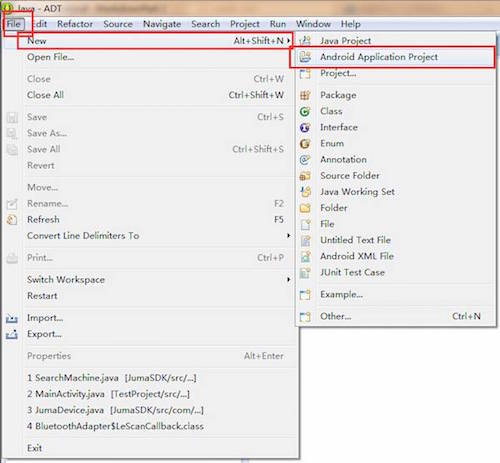
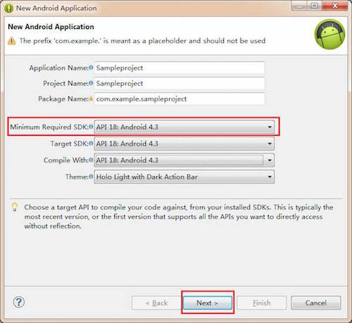
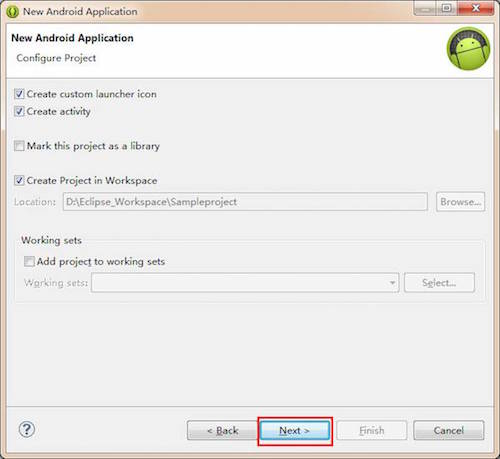
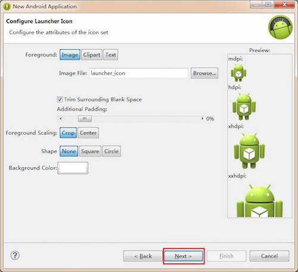
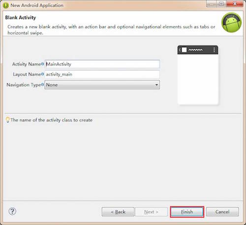
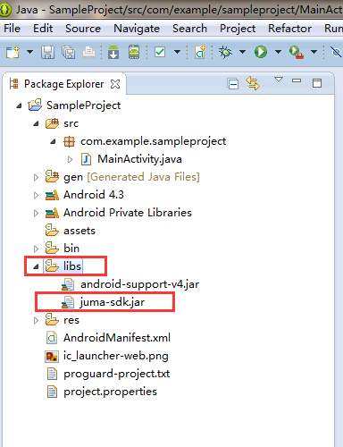
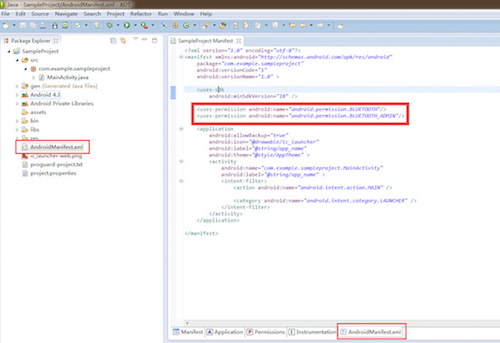

本文介绍JUMA的Android SDK的环境搭建及其使用。

Android SDK配合嵌入式SDK共同实现设备-手机的蓝牙通信功能。相对于Android原生BLE SDK，它能确保更为稳定的蓝牙联通操作，而且使用起来更为简单，开发者不再需要了解BLE特有的如service、characteristic、notification等概念。此外，该SDK还增加了例如设备端固件空中升级(OTA)的功能。

## Android环境搭建
###1. 使用Eclipse创建Android工程
Step 1. 点击 File -> New -> Android Application Project.



Step 2. 输入Application Name 、Project Name 、 Package Name.

Step 3. 选择Minimum Required SDK： API 18: Android 4.3.

Step 4. 点击 Next.



Step 5. 点击Next.



Step 6. 点击Next.



Step 7. 点击Next.


Step 8. 输入Activity Name、Layout Name.  

Step 9. 点击Finish.  



###2. 将SDK加入到工程中

Step 1. 将juma-sdk.jar放入到工程的libs文件夹中



Step 2. 打开AndroidManifest.xml文件
Step 3. 在AndroidManifest.xml加入以下两条权限：

```
	<uses-permission android:name="android.permission.BLUETOOTH"/>
	<uses-permission android:name="android.permission.BLUETOOTH_ADMIN"/>
```




***
## SDK使用概述

SDK分成了三个类，需要在工程中分别对其实例化。

###1. ScanHelper 
该类用于扫描BLE设备，如开始扫描、停止扫描等BLE操作。  
其中ScanCallback是一个接口，用于获取BLE设备扫描的结果，它以Callback的形式通知应用程序：

```
	ScanHelper scanHelper = new ScanHelper(getApplicationContext(), scanCallback);

	ScanHelper.getVersion();
		
	scanHelper.enable();
		
	scanHelper.disable();
		
	scanHelper.isEnabled();
		
	scanHelper.startScan(name);
		
	scanHelper.stopScan();
		
	scanHelper.isScanning();
	
	ScanHelper.ScanCallback scanCallback = new ScanCallback() {
			
		@Override
		public void onScanStateChange(int newState) {
			// TODO Auto-generated method stub
			
		}
			
		@Override
		public void onDiscover(JumaDevice device, int rssi) {
			// TODO Auto-generated method stub
				
		}
	};
		
```


###2. JumaDevice 
该类代表了一个BLE设备，实例化该类之后可以对一个BLE设备进行如发送数据、获取设备名称、固件升级等操作。

```
	@Override
	public void onDiscover(JumaDevice device, int rssi) {
	
		/* 上述ScanCallback中的onDiscover回调
			返回了被扫描到的蓝牙设备 */

		device.connect(jumaDeviceCallback)；

		device.getVersion();

		device.getName();

		device.getUuid();

		device.disconnect();

		device.isConnected();

		device.send(type, message);

		device.getRemoteRssi();

		device.updateFirmware(url);

		device.isFirmwareUpdating();
				
	}		
```

###3. JumaDeviceCallback 
该类用于获取与BLE设备通信相关的事件，如接收到数据、断开连接、发送数据等，以Callback的方式通知应用程序：

```
	JumaDeviceCallback jumaDeviceCallback = new JumaDeviceCallback() {

		@Override
		public void onConnectionStateChange(int status, int newState) {
			// TODO Auto-generated method stub
			super.onConnectionStateChange(status, newState);
		}

		@Override
		public void onReceive(byte type, byte[] message) {
			// TODO Auto-generated method stub
			super.onReciver(type, message);
		}

		@Override
		public void onSend(int status) {
			// TODO Auto-generated method stub
			super.onSend(status);
		}

		@Override
		public void onRemoteRssi(int status, int rssi) {
			// TODO Auto-generated method stub
			super.onRemoteRssi(status, rssi);
		}

		@Override
		public void onUpdateFirmware(int status) {
			// TODO Auto-generated method stub
			super.onUpdateFirmware(status);
		}
			
	};
```

***
## 开源代码和例程

SDK现在已经全部开源，您可以从以下地址获取： 

* SDK代码仓库：[https://github.com/JUMA-IO/BLE_SDK_Android](https://github.com/JUMA-IO/BLE_SDK_Android)

此外，我们还提供了一些使用SDK的例程，包括：

* BLE调试助手：[https://github.com/JUMA-IO/BLE_Debugger_Android](https://github.com/JUMA-IO/BLE_Debugger_Android)
* BLE SensorTag(传感器)：[https://github.com/JUMA-IO/BLE_SensorTag_Android](https://github.com/JUMA-IO/BLE_SensorTag_Android)
* BLE Toolbox(工具箱)：[https://github.com/JUMA-IO/BLE_Toolbox_Android](https://github.com/JUMA-IO/BLE_Toolbox_Android)


