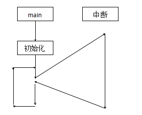
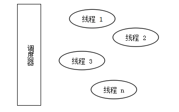
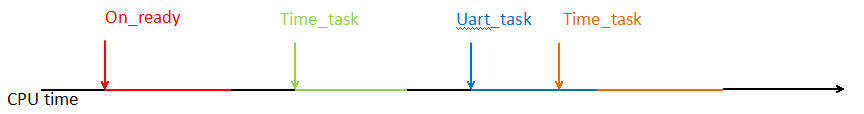
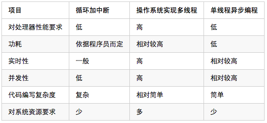

##背景知识
在IT技术高速发展到今天，在为我们的生活带来了翻天覆地的变化的同时。如何更有效的利用计算机资源为我们更好的服务的思考，一直是各大厂商与技术大牛们为之孜孜不倦奋斗的方向。虽然硬件性能在被不断的提升，然而需求的增长速度还是远远的超过了硬件性能的增长速率，因此人们不断的提出各种编程模型想要以此来用软件的方式来弥补硬件性能上的不足。

尤其是物联网行业，其产品对功耗敏感，对成本也敏感，然而却又要求能够有较高的并发性，同时还要要求能较多的完成规定的任务。因此对编程模型的选择开始变的复杂了起来。时至今日，在IT行业中普遍采用的编程模型有以下这么几种。  

***
##现有编程模型
编程模型也就是为了解决某一类的具体问题，然后经过长时间的经验积累总结的适用于解决某种问题的编程套路。现在最常见的有在嵌入式编程中普遍采用的循环加中断的方式，与在实时系统中采用的基于操作系统的多线程编程等。

###1. 循环加中断
循环加中断的编程模型在单片机等嵌入式设备中被普遍采用，其编程模型可以概括为下图形所示的样子。  

在这种编程模型中，往往有明确的函数执行入口main，系统在执行完必备的初始化操作后，就将控制权完全的交给main函数，然后其他的一切操作都是从main函数开始， main函数中会对需要使用到的外设进行必要的初始化等工作，然后系统会进入到一种循环等待的状态，俗称死循环。直到中断到达后会暂停当前的死循环，然后转去执行别的操作，执行完毕后继续退回到死循环中。如果没有中断到来的话，那么就一直执行死循环中的代码。在本模型中以中断的方式替代了以轮询的方式去检查是否有任务需要去处理，在编写代码上无疑简单了很多，在实时性上也要比采用轮询的方式要好很多。而且现代的处理器一般都支持多个中断源，并且中断源中还设有不同的优先级，这样在中断中也可以实现嵌套，来保证高优先级事件一定能实时完成。然而其存在的问题也是很明显的，虽然从main函数开始所有的任务都由用户来完成，获取了最大的自由度，但是这样一来，用户需要编写的代码量在一些对功耗或者是其他要求比较高的场合将会变的奇大无比。

####优点：  
- 控制过程直观
- 可以控制底层寄存器
- 性能较强（看编程人员能力）

####缺点：  
- 编程复杂度较高。
- 需要完成大量的非业务逻辑上的工作。
- 在对系统功耗等的控制上复杂度高。

###2. 操作系统实现多线程
在多线程的编程模型中，能够采用这种编程模型的处理器一般都是处理性能相对较强的处理器，如桌面电脑，服务器，手机等设备中。在这种编程模型中，首先由操作系统虚拟出很多个程序运行空间，然后各个线程在调度器的调度之下按照时间片的方式运行，每个线程的运行执行都可以被认为是一个单独的程序，其自身完全的占用系统资源，一般用在对实时性和并发性的要求很高的情况下。其编程模型可用如下图所示的样子来进行概括。  

在这种编程模型中，所有的线程在调度器的统一指挥下单独运行，每个线程都可以被调度器暂停或者恢复运行，而对于线程本身来说，其并不关心自己在何时被运行，在何时被中断，它唯一关心的是其自身是否能在规定的时间内正确的被执行完毕。 

####优点：  
- 实时性强。
- 并发度高。
- 编程复杂度相对较低。

####缺点：  
- 需要操作系统
- 对处理器的要求高
- 功耗相对较高
- 需要较多的系统资源（RAM等）。

###3. 单线程异步编程
单线程的异步编程模型在浏览器中（Javascript）和图形化程序设计中采用的比较多。在这种编程模型中，所有的任务在一个轻量级的系统调控器的作用下，被安排成线性的方式去执行，当有事件发生的时候，相应的事件处理函数会被系统调控器自动的调用，当没有任何事件到达的时候，系统将由调控器接管。  

因此，在采用单线程异步编程的时候，编程过程可以概括为以下2步：  

1. 注册需要处理的各种事件。  
2. 在相应的事件处理函数中编写事件到达后要完成的功能。

就本模型的功能上，介于上述的两种模型之间，对比循环加中断的方式其多了运行在后台的一个任务调度器，但是这个调控器的实现非常的简短，当且仅当在其他的任务执行完毕后主动让出处理器后才会去接管系统的运行，而在任务的处理过程中则是由事件处理函数本身来完全的掌控处理器。

采用这种编程模型来开发产品的时候，用户不需要关心，事件是如何被触发的，用户只需要使用正确的方式来在系统中注册相应的事件，然后编写好相应的事件处理过程就可以了。

比如在上图中，On_ready这个事件是在系统上电，准备就绪后被调用的。如果在这里需要处理一些事情，那么就在on_ready的函数中将想要实现的功能写出来就好了，比如在这里可以向系统注册一个事件，当100ms后执行一个time_task事件。然后当前on_ready函数执行完毕退出，系统交由调控器来控制，直到100ms后，调控器会产生一个time_task的事件，如果用户有编写好相应的事件处理函数的话，那么相应的处理过程就会被调用。

####优点：  
- 编程复杂度低。
- 用户可以专注业务逻辑部分。
- 开发周期短。

####缺点：  
- 一定的功能要受到框架的制约。

***
##最适合物联网的编程模型
通过对上面的几种编程模型的对比，可以得出以下结论。  

对于物联网产品来说，其一般来说要求体积较小，对功耗敏感，要求能进行并发处理，但是事件的处理次数不会太频繁，同时对成本敏感，因此在处理器的选择上也无法选择性能很高的产品。

通过上述各种编程模型的对比，可以看出，基于对处理器的性能和功耗上的制约，采用操作系统实现的多线程方案，完全无法应用到物联网的产品中。而采用循环加中断的方式来实现物联网产品的设计的话，将要面临的难题是，在功耗等方面对程序员能力要求很高，代码的实现非常的复杂。最终得到的结果却是实时性能力一般，并发能力很低。而反观单线程异步编程，虽然其处理能力上确实不如基于操作系统实现的多线程方案，但是其表现能力则要比循环加中断的方式要优异很多。

由于单线程异步编程的调控器完成的功能较少，因此对处理器的要求不高，在功耗上，在调控器上已经实现了整个系统的节能方案，因此应用层无需理会功耗上的问题即可实现低功耗的产品。

同时，在物联网产品中，根据应用场合的不同，各个产品要完成的功能千差万别，且品种繁多，因此要求代码编写复杂度要尽可能的少。

基于以上的分析，采用单线程异步编程的方式，是目前物联网领域中最为合适的一种解决方案。