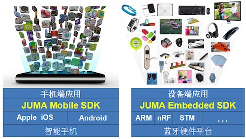
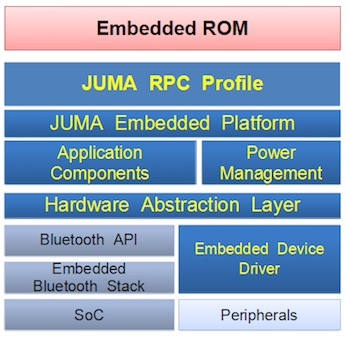
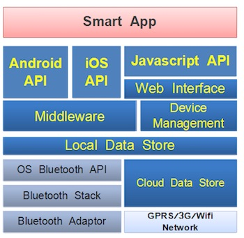

##引言

随着低功耗蓝牙技术（Bluetooth Low Energy, BLE）的兴起，越来越多的智能硬件产品使用该技术作为近距离无线通信的首选方案。

实际开发过程中，一些不确定的因素会使得开发周期和成本变得难以估计和没有保障。我们发现开发人员往往花费太多的时间来学习低功耗蓝牙技术本身，譬如，阅读一颗新的蓝牙芯片的芯片手册，或是熟悉Android或iOS的蓝牙API文档。然而，对于如何延长蓝牙产品的续航能力、建立高可靠性的蓝牙连接、移动终端的蓝牙兼容性等关键技术上，也是每一个开发者经常会面临的问题。

为此，JUMA SDK规划的初衷就是解决这些问题，力图打造最简单易用的BLE应用开发框架，将开发者从蓝牙中解放出来。JUMA为开发者做好蓝牙，开发者做好产品本身。

JUMA SDK分为了嵌入式SDK和移动端SDK：    

***
##嵌入式SDK

目前，嵌入式SDK支持Nordic的nRF51822低功耗蓝牙芯片和STM的BlueNRG芯片。

嵌入式SDK将大量智能硬件所需的常用功能进行“模块化”封装，涵盖了例如串口、ADC、蜂鸣器、LED、OLED、G-Sensor等外设，也支持一系列场景的定制化应用，如iBeacon、计步器、血压计等。开发者可以快速地完成方案验证或是产品原型，灵活地定制应用需求，用最低成本、最短时间将产品推到市场。

除了外设驱动和应用配置方面的支持，我们的嵌入式SDK还具备了一些如：实现了更适应于物联网的嵌入式任务调度、低功耗管理、云端消息转发、算法聚合等功能和特性，这样进一步降低了蓝牙开发的门槛和成本。

嵌入式SDK的内部实现架构为：  

***
##移动端SDK

移动端SDK具有Android和iOS的API接口，和上述嵌入式SDK配合使用。相对于Android或iOS的原生BLE接口，它能确保更为稳定有效的蓝牙互联互通性操作，并且使用起来更为简单，开发者不再需要考虑BLE特有的如service、characteristic、notification等概念。

此外，移动端SDK的Javascript的API接口正在实现，未来可供HTML5移动应用直接调用，这是一种跨平台的BLE编码方式。我们也会陆续支持APICloud、Cordova、CrossAPP等plug-in，以提供更为丰富的跨平台开发支持。

移动端SDK的内部实现架构为：  

***
##云端支持

JUMA云是一个专门为物联网和智能硬件打造的云服务，主要负责设备的数据储存、安全认证、OTA升级、事件统计等功能，成为智能硬件应用的一个后台服务和管理框架。

JUMA云简化了服务器端开发工作，让开发者不必搭建服务器，只需要少量、甚至不用服务器编码，就可以实现智能硬件所需的各种云服务的接口。

***
##获取SDK
JUMA的嵌入式SDK和移动端SDK现已完全开源，在遵守开源协议的条件下，您可以自由使用。

获取和查阅SDK具体内容，请参阅各部分文档或者点击SDK官方主页：  
[http://www.juma.io/sdk.html](http://www.juma.io/sdk.html)

