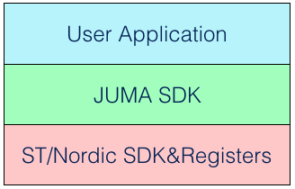

##系统架构
JUMA SDK编程框架将嵌入式程序分成三个层次：  

其中：  

- 最底层的是芯片原厂提供的开发包和编程接口，如ST、Nordic的SDK及其寄存器编程接口。
- 中间层为JUMA SDK，它整合了低功耗蓝牙(BLE)、外设驱动、算法、功耗管理等组件。整个SDK具有一套统一的编程框架，这体现在任务调度、中断处理、事件回调等方面，使得软件聚合具有一致性。
- 最高层为用户应用层，即，开发者使用SDK开发自己的应用程序。

***

##硬件平台

SDK支持nRF51平台和STM32平台：

* nRF51平台：基于Nordic nRF51822芯片的硬件产品，JUMA开发的[NOVA](http://www.juma.io/platform/nova.html)、[SMP](http://www.juma.io/platform/smp.html)等开发板就属于nRF51平台。
* STM32平台：基于STM32 MCU和BlueNRG(蓝牙收发器)的硬件产品，JUMA开发的[Cannon](http://www.juma.io/platform/cannon.html)开发板就属于STM32平台。

> 请根据您手上的开发板，查看相应的开发指南，包括开发环境、API说明、例程等。

***
## 嵌入式软件

目前，在兼容性问题上，SDK的API尚未兼容nRF51和STM32两个平台，说明如下：

* `JSENSOR API`、`BLE主设备 API`、`USB API`是STM32平台特有的API；
* nRF51平台不支持上述STM32平台特有的API，其他的API都予以支持；

