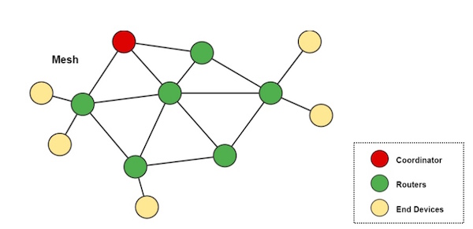

Mesh网络即”无线网格网络”，它是一种无线自组网技术。Mesh网络基于呈网状分布，可以让众多无线节点间的相互合作和协同，下图是一个典型的Mesh网络拓扑结构：



其中，黄点是节点，绿点是路由节点，红点是网关或者中控设备。通常对于无线传感器的应用来说，节点将采集到的数据发送出来，路由节点收到后，将数据传输到网关或者中控设备。

我们用低功耗蓝牙技术实现了Mesh网络，改善了低功耗蓝牙传统*中心式组网*的不足，使得低功耗蓝牙网络的覆盖距离大大增加，并且该网络具有动态自组织、自配置、自维护等特点。


API声明和数据结构说明见头文件：

* STM32平台：[mesh.h](https://github.com/JUMA-IO/STM32_Platform/blob/master/system/juma/inc/mesh.h)

蓝牙主设备的API使用例程请参见：[host](https://github.com/JUMA-IO/STM32_Platform/blob/master/product/application/mesh/mesh.c)。

> 本系列API仅支持STM32平台。


***
## 数据结构
### API调用状态
`mesh_status_t `表明了API的调用状态，它是一个`unit8`类型，在`mesh.h`头文件中通过枚举预置了一些状态，摘取部分如下：

宏定义    | 数值  | 说明
:----- | :-------- | :------
mesh_ok | 0x00    | API调用成功
mesh_failed | 0x01    | API调用失败


> 完整宏定义请参阅：[mesh.h](https://github.com/JUMA-IO/STM32_Platform/blob/master/system/middlewares/juma/mesh/mesh.h)。  


***
## 设置manufacturing data ，将设置到广播数据中
###1. 结构体声明
```
typedef struct _mesh_manuf_data_t{
 
    uint8_t   len;              //total data length
    uint8_t   data_type;        // advertise data type
    uint16_t  adv_info_number;  // advertising information number
    uint16_t  data;             // user data
}mesh_manuf_data_t;
```

###2. 结构体数据功能
配置mesh网络中的有效信息，adv_info_number消息版本号、data用户数据。

###3. 函数参数
参数    | 数据类型   | 说明
:----- | :-------- | :------
len| uint8_t  |manufacturing data 总的数据长度(不包含len的1Byte)
data_type| uint8_t|加入到广播数据中的数据类型(mesh用到的是`AD_TYPE_MANUFACTURER_SPECIFIC_DATA`)
adv_info_number| uint16_t|mesh网络中消息的版本编号
data| uint16_t|用户想要发送的数据


***
## mesh网络扫描到广播的信息
###1. 函数声明
```
void mesh_rx_scan_data(void* data)
```

###2. 函数功能
接收到扫描到的mesh网络中的广播信息、判断广播信息版本是否为最新版本，给用户层提供最新版本的信息、
配置设备广播最新版本的消息

###3. 函数参数
参数    | 数据类型   | 说明
:----- | :-------- | :------
data  | void*    | void类型指针


***
## 在蓝牙连接状态下接收主机端更新mesh网络消息
###1. 函数声明
```
void mesh_rx_host_message(void* data)
```

###2. 函数功能
接收来自主机端的更新消息,断开与主机端的连接以及时将主机更新的消息在mesh网络中更新、将主机更新的消息提供给用户层进行处理、更新广播消息。

###3. 函数参数
参数    | 数据类型   | 说明
:----- | :-------- | :------
data  | void*    | void类型指针


***
## mesh网络消息回调,将mesh网络中最新的消息提供给用户层
###1. 函数声明
```
void mesh_on_message(void* data)
```

###2. 函数功能
将mesh网络中最新的消息交给用户层进行处理

###3. 函数参数
参数    | 数据类型   | 说明
:----- | :-------- | :------
data  | void*    | void类型指针


***
## mesh demo 说明
###1. 在app.c中定义该设备在mesh网络中的ID

###2. 更改广播名字

###3.demo中设备的MESH_ID与mesh网络中的控制数据16bit的data是按位与的关系，
eg.data:1010 0000 1111 0001
   则mesh_id与上data不为0则亮，为0则灭
###4.因此MESH_ID要与移动端发送的数据配合起来


***