本文介绍JUMA的iOS SDK的环境搭建及其使用。

iOS SDK配合嵌入式SDK共同实现设备-手机的蓝牙通信功能。相对于iOS原生BLE SDK，它能确保更为稳定的蓝牙联通操作，而且使用起来更为简单，开发者不再需要了解BLE特有的如service、characteristic、notification等概念。此外，该SDK还增加了例如设备端固件空中升级(OTA)的功能。

以下所有内容全部基于 Xcode 6 完成. 如果没有 Xcode 的使用经验, 请严格按照下面所说的进行操作, 并在需要输入的地方输入相同的内容  

## Android环境搭建
###一、新建一个 Xcode 工程
####1.打开 Xcode  
启动 Xcode 之后会如下的 Welcome 窗口, 窗口的右侧列出了曾经打开过的工程. 如果没有出现窗口, 请点击 dock 栏上的 Xcode 图标.  
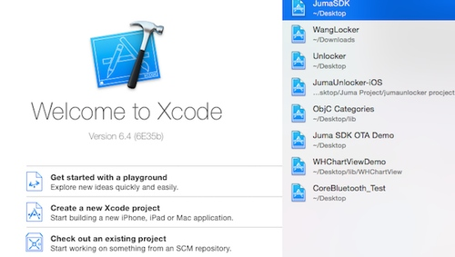  

####2.开始创建工程  
Welcome 窗口的左下角列出了 3 个可供选择的选项, 点击第 2 个 "Create a new Xcode project", 会出现一个助手窗口. 在助手窗口中, 按照红色箭头的指向, 依次点击红色方框中的内容, 以便创建一个只有单个空白页面的新工程.    
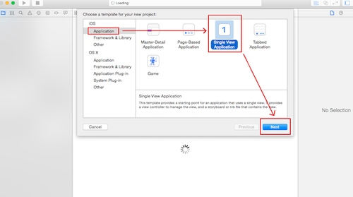  

####3.完善 app 的信息  
完成第 2 步之后, 会出现一个如下的新窗口, 在这个窗口中, 为这个新的工程完善信息.  
从上往下  
第 1 项: Product Name, 即产品名称, 也可以理解为 app 的名字  
第 2 项: Organization Name, 即组织名称, 也就是公司名称或者团队名称  
第 3 项: Organization Identifier, 即组织标识符, 一般格式为: com.公司名  
第 4 项: Bundle Identifier, 即包标识符, 由第 3 项和第 1 项共同组成.
第 5 项: Language, 即用来编写这个 app 的编程语言, 可选值有 Objective-C 和 swift, 在本使用说明使用 Objective-C.
第 6 项: Devices, 即目标设备的种类, 也就是你的 app 准备运行在哪个种类的 iOS 设备上, 可选值有 iPhone, iPad, Universal(通用), 在本使用说明使用 iPhone.  
第 7 项: Use Core Data, 即是否在项目中创建 CoreData 文件以便存储数据. 如果不清楚是否要创建 CoreData 文件, 请不要选中此项.  
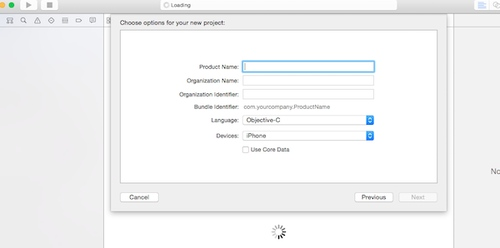  

app 信息示例: (在完善了所有信息之后, 请请点击如下图所示的红色方框中的按钮)  
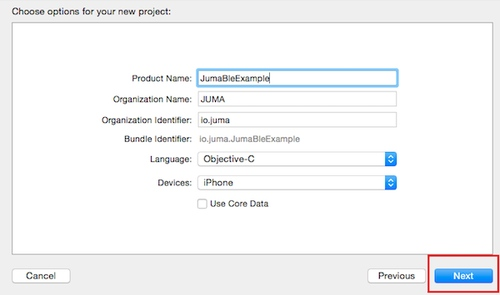  

####4.选择工程文件的存放位置  
完成第 3 步后, 会弹出如下窗口以便选择工程文件的存放位置. 选好位置以后, 请点击图中红色方框中的按钮.  
注: 如果不明白红色圆形包围的选项的含义和作用, 请不要选中它.  
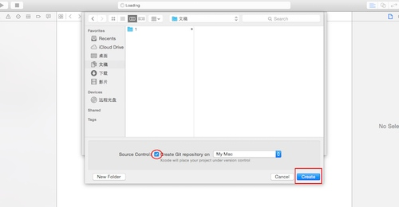  

###二、修改这个工程的配置
####1.app 的基本配置
在创建一个 Xcode 工程之后, 会出现如下所示的窗口. 在这个窗口中, 可以修改 app 的一些配置, 红色方框中的是 2 个常用配置:
第 1 个: Deployment Target, 是这个 app 可以兼容的, 最低的 iOS 版本. 点击右侧向下的箭头, Xcode 会列出所有可供选择的 iOS 版本号. (Juma SDK 支持的最低的 iOS 版本是 iOS 7.0)  
第 2 个: Devices, 是这个 app 可以运行的 iOS 设备的种类, 点击右侧向下的箭头, Xcode 会列出可选值.    
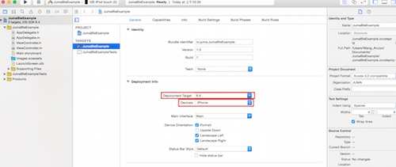  

####2.为工程添加 CoreBLuetooth 框架.  
为了在工程中使用 Juma Bluetooth SDK, 需要为这个工程添加 CoreBluetooth 框架. 请参照红色箭头的顺序, 依次点击红色方框中的内容.  
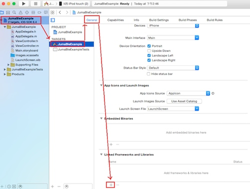  
随后, 会出现如下的窗口  
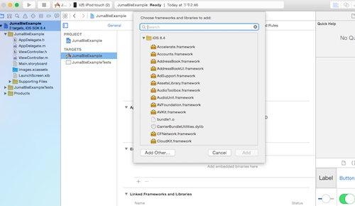  
在搜索框中输入 CoreBluetooth, 按照红色箭头的顺序, 依次点击红色方框中的内容.  
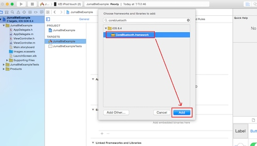  
出现下图的两个红色方框中的内容时, 说明框架添加完成.   
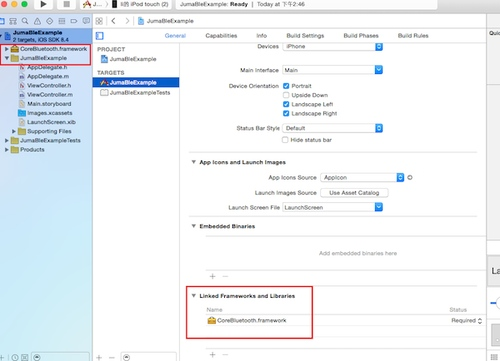  

####3.为工程添加链接参数   
为了在工程中使用 Juma Bluetooth SDK, 需要为这个工程添加一个链接参数. 请参照红色箭头的顺序, 依次点击红色方框中的内容, 在最后一个红色方框内的搜索框中输入 Other Linker Flags.  
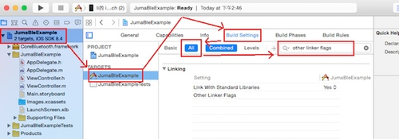  
在下图的长方形红色方框的末尾双击, 会出现一个编辑窗口, 用来添加/删除参数. 编辑窗口出现后, 点击正方形红色方框中的 + 号.    
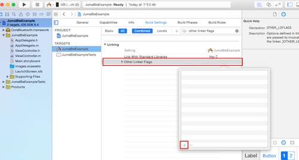  
点击 + 号以后, 会出现下图红色方框所示的输入框, 在输入框中输入 -ObjC.  
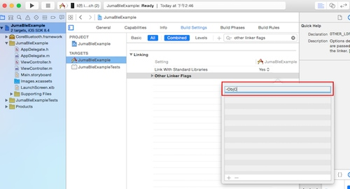  
输入完成后, 点击编辑窗口以外的空白区域, 出现下图红色方框中的内容时, 就说明参数添加成功.  
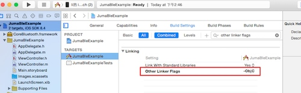  

####4.让 app 能够在后台运行  
iOS 系统支持有限的几种允许 app 在后台运行的模式, 蓝牙形式的后台模式就是其中之一. 为了让 app 能够在后台完成蓝牙任务, 请参照下图红色箭头的顺序点击并完成红色方框中的内容.  
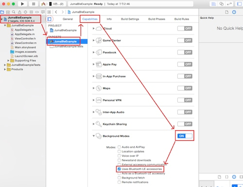  

###三、向工程添加 Juma SDK 的代码文件
找到以黄色的文件夹图标开头, 并和工程同名的那一行, 如下图所示  
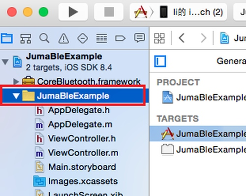  
在这一行上右键, 点击右键菜单中的 Add Files to 选项  
  
随后会出现一个如下的窗口用来查找 Juma SDK 的代码文件的位置, 找到文件后, 从上到下, 依次完成红色方框中的内容.  
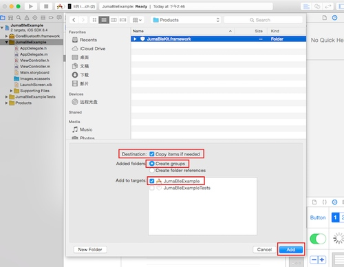  
完成上一步以后, 出现类似如下图所示内容, 就表示 Juma SDK 代码文件添加成功.  
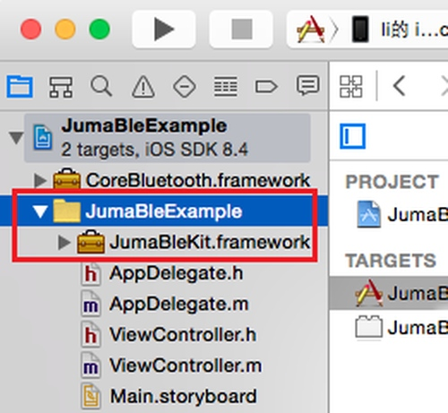  

至此, 创建工程, 修改工程的配置, 添加 Juma Bluetooth SDK 文件就全部完成了.  

***
## 开源代码和例程

SDK现在已经全部开源，您可以从以下地址获取： 

* SDK代码仓库：[https://github.com/JUMA-IO/BLE_SDK_iOS](https://github.com/JUMA-IO/BLE_SDK_iOS)

此外，我们还提供了一些使用SDK的例程，包括：

* BLE调试助手：[https://github.com/JUMA-IO/BLE_Debugger_iOS](https://github.com/JUMA-IO/BLE_Debugger_iOS)

