##获取软件资源
使用JUMA的嵌入式SDK需要以下软件资源：

1.Keil的编译环境：
	ARM编译器，可从相应的Keil官网进行相应的下载。下载地址：  
	[https://www.Keil.com/demo/eval/arm.htm](https://www.Keil.com/demo/eval/arm.htm)	

2.nRFTools_6_0_0_Installer：
	Nordic公司提供的用于对其旗下nRF51822等芯片进行下载管理等的软件集成包。下载地址：  
	[https://developer.mbed.org/media/uploads/nemovn/nrftools_6_0_0_installer.exe](https://developer.mbed.org/media/uploads/nemovn/nrftools_6_0_0_installer.exe)

3.JUMA SDK集成包：
	SDK发布在下述地址，请选择下载最新的集成包：  
	[http://www.juma.io/doc/zh/introduction/sdk/platform/downloads.html](http://www.juma.io/doc/zh/introduction/sdk/platform/downloads.html)  

>其中，Keil的Nordic芯片Package，如果国外官网下载不方便，JUMA也提供了镜像下载链接：
	[http://pan.baidu.com/s/1i3Lei3b](http://pan.baidu.com/s/1i3Lei3b)

***
##安装Keil
Keil的安装一般不会出现问题，在整个安装过程中一般只要一直Next就可以了。  
不过如果想要知道每一步所完成的功能等，可以参照下面的介绍。	

1.双击MDKxxx.exe开始安装过程。  
2.当出现如下图所示的界面后，安装过程正式开始了。  

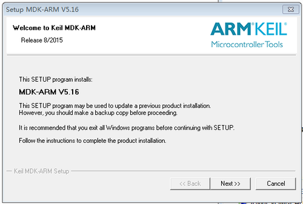

3.直接点击上图中的Next，进入下一步的安装，出现如下图所示的界面：  

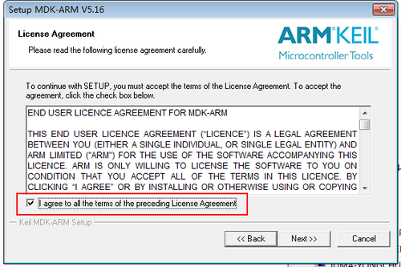

4.选中图中红色框中的内容表示接受Keil的协议，然后点击Next进入下一步的安装，出现如下的界面：  

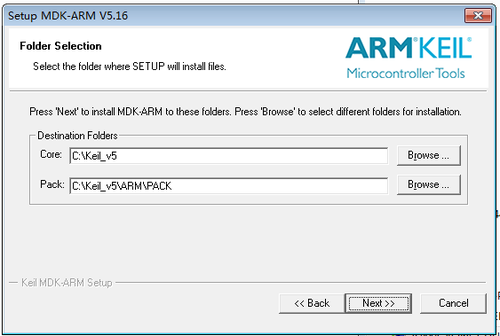

5.这一步需要选择的是Keil安装的位置，以及包(Package)安装的位置。选择好后，点击Next会进入到下一个界面：  
> 所谓的“包”就是各种芯片的配置和标准库文件等，请记住这个位置，后续可能会用到。

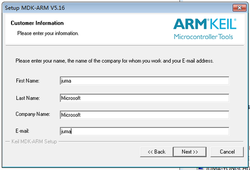

6.这里需要的是填写相关的个人信息，不过经发现，这里可以随意的填写就可以了，感谢Keil如此（人性化）的设计。填写好信息后点击Next进入到下一个界面：  

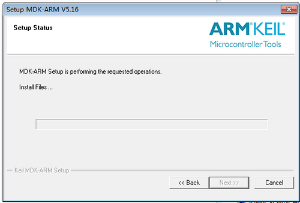

7.在这个界面中需要稍作停留了，等待一段时间后，会进行一次询问，是否需要安装Keil的一个串行下载工具：  

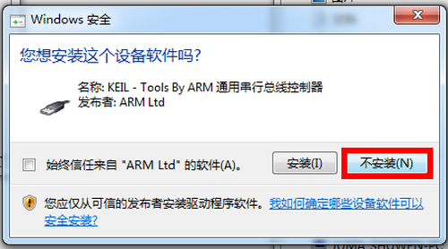

8.出现上图的选择后，在JUMA的整个方案中，并不需要这个，所以可以选择不安装。之后经过一点点时间等等待后就会提示安装成功了。

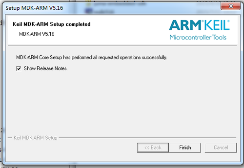

9.出现上图的界面后安装过程就完成了，但是在从Keil5.10之后的版本开始内部集成了包管理机制，通过这个，可以方便的对各种MCU的库文件等进行管理。

我们在接下来的教程里面详细的对包管理进行描述。  

***
##安装nRF51822包(Package)
在Keil安装完成以后就是进行包的下载或者导入。  

包的导入有以下的两种手段，一种是在线下载，优点是能确保包是最新的。但是可能会带来一些问题，首先是由于是在线下载，要受限于网络，下载很有可鞥会出现失败的情况，其次，最新的包还有可能会出现和JUMA的sdk无法兼容的情况（JUMA使用的包为2015年9月16日在线下载额包）。所以，建议采取第二种方式，直接导入现有的包。  

接下来我们将分别对这两种安装方式进行介绍：  

####1.在线下载包
当Keil安装成功后，会弹出这么一个对话框：  

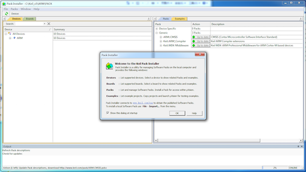

点击OK后会自动的去更新当前的内容。  
更新完成后会出现如下所示的界面：

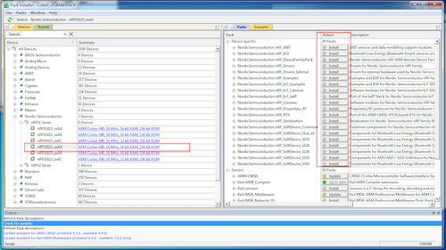

然后按照图中所示展开左侧的树状结构，然后根据目标芯片选择左侧的芯片方案，（本教程采用的是nRF51822AA）,选择后，可以看到右侧一堆处于未安装状态的，点击就可以开始在线的安装了。  

安装完毕后显示的效果如下所示。

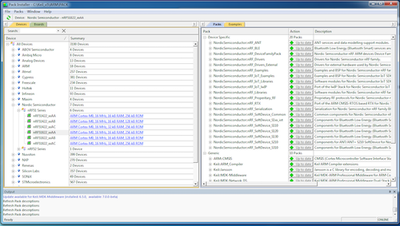

####2.从已有的地方导入包

JUMA提供了nRF51822的导入包，下载地址为：  
[http://pan.baidu.com/s/1dDfmSgx](http://pan.baidu.com/s/1dDfmSgx)

下载并解压，文件夹如下图所示：  

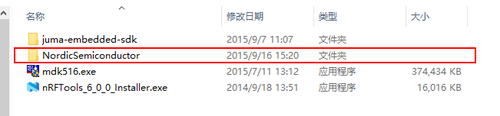

在将Keil安装好后，只需要将这个文件夹放入到`刚才安装过程中的那个包位置下`。如果没有修改过安装路径的话，其一般在：  

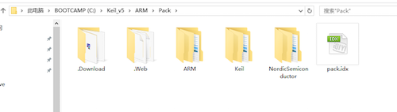

只需将上述的NordicSemuctor整个的文件夹放入到上图中的位置就可以了。  
之后就可以打开Keil，然后点击如下所示的位置，刷新后就可以看到相应的包已经被更新过了。  

点开后可以看到如图所示，所有的包已经准备好了。  

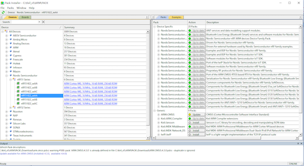

OK，到这里，所有的Keil相关的内容就全部安装完成。

***
##安装Nordic nRFTools
1.双击打开该软件：出现如下的安装界面。  

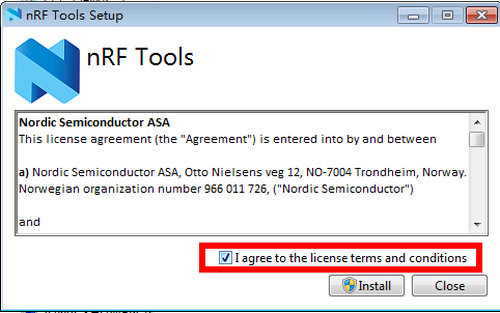

2.选中图中红框所在的位置。然后点击Install开始安装。会出现以下的安装界面：  

3.短暂的等待之后，会出现如下图所示的安装界面：  

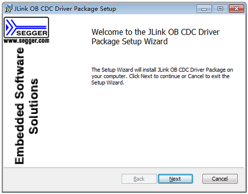

4.之后点击Next会出现，如下所示的界面：  

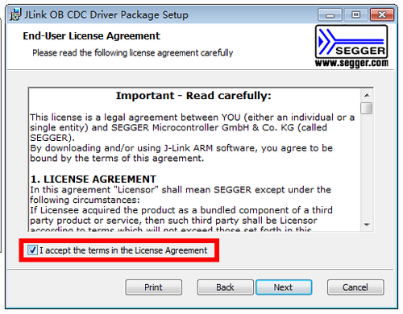

5.选中图中的红框的内容，然后继续Next。出现如下的界面：  

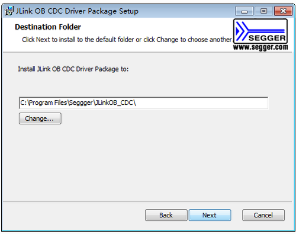

6.这里用来选择要安装的位置，建议采用默认的位置。之后继续Next。  

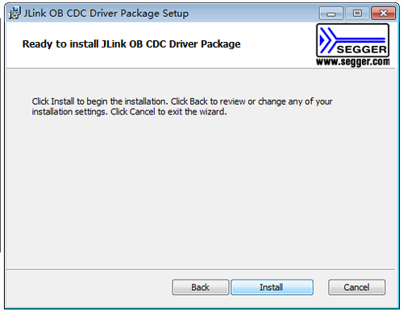

7.前面的几步已经将需要进行设定的地方设定完成了，在这里点击install开始这部分的安装。短暂的等待后会进入到这一步的界面中。  

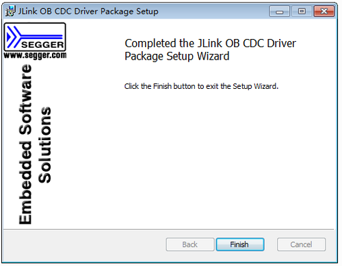

8.点击finish第一步的安装就到此结束了。之后短暂的等待后会出现如下的界面：  

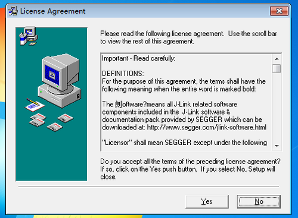

9.从这里开始进行J-Link驱动的安装。点击yes，进入到下一个安装界面：  

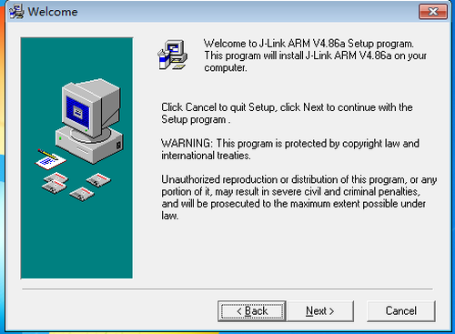

10.继续Next，进入下面的界面:  

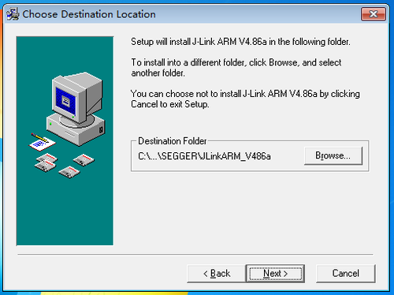

11.继续点击Next，进入下面的安装界面：  

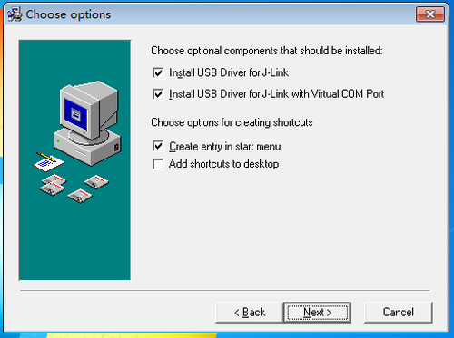

12.继续点击Next，出现下面的界面：  

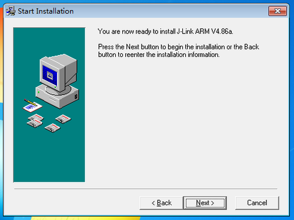

13.继续Next，后会出现下面的界面：  

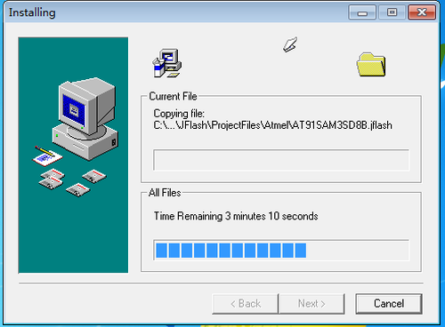

14.静静的等待片刻，会出现如下图的界面：  

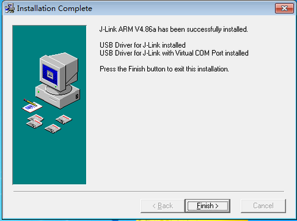

15.点击finish完成本阶段的安装。之后会自动返回到原来的安装界面然后短暂的等待后，会出现如下的界面：  

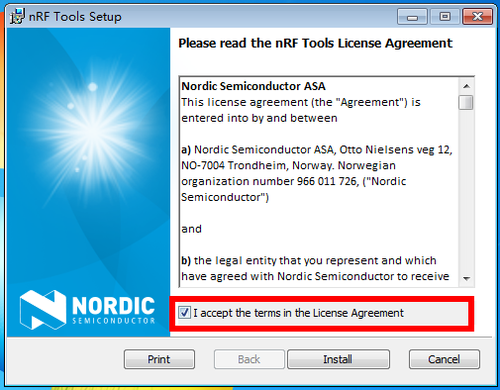

16.选中红色框，然后点击install之后会出现如下的界面：  

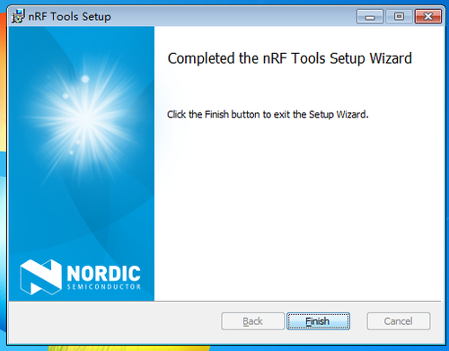

17.点击Finish完成本次的全部安装步骤。  

***
##固件烧录测试
在[Github仓库]()https://github.com/JUMA-IO/nRF51_Platform获取nRF51平台的例程，按照如下步骤进行操作：  

1.使用J-Link与目标板连接  
具体的连接方式请参照对应的板子连线，一般是Vcc、Data、Clk、Gnd四根引脚。

2.烧录固件库  
进入juma_embedded_sdk的images目录下，会看到如下的内容：
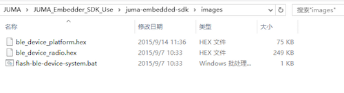

双击图中的批处理脚本，如果上面的环境安装正确，并且电路连接正确的话，那么下载就可以顺利的进行了。  
成功的下载会提示如下类似的所示：  

3.打开工程模版开始第一个程序
由于不同板子的程序也不完全的相同，所以，接下来的内容请参照每个板子各自的教程。
