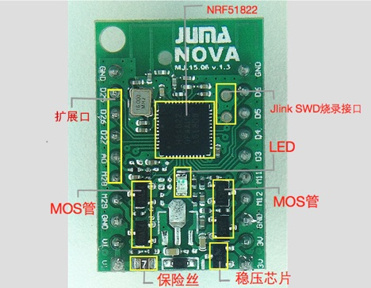
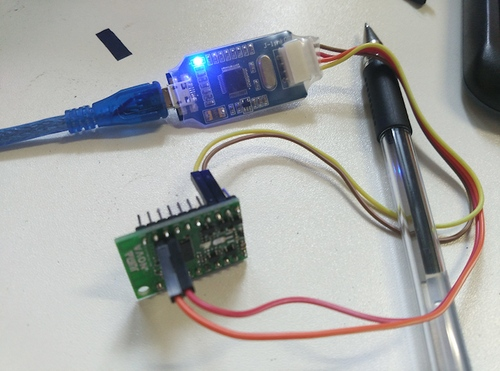
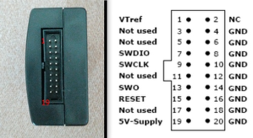
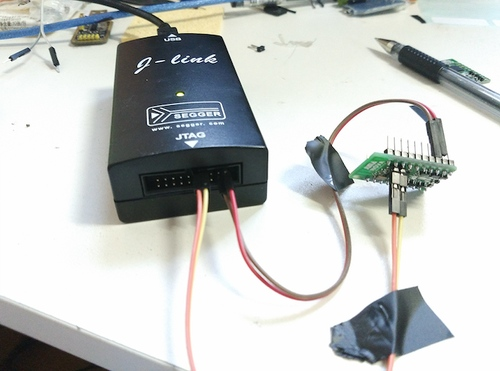
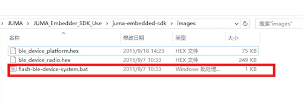
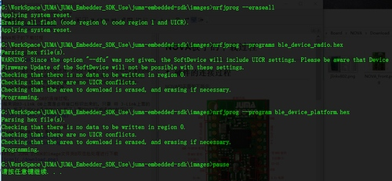

##SWD调试接口
NOVA的正面如下所示:

nRF51822采用的是SWD的调试接口，所以，这里需要用到J-Link的调试器。从上图中可以看到SWD的烧录接口。  

一般来说，调试器有两种，一种是常见的J-Link，还有一种就是J-LinkOB这样的精简版本的调试器。

###1. NOVA与J-Link OB的连接方式
一般J-Link OB上面是会将接口标识出来的。只要将J-Link上面的`CLK`与板子上的`CLK`连接，J-Link上面的`DIO`与板子上面的`DIO`互相连接，烧录器就连接好了。

###2. NOVA与J-Link v8的连接方式
J-Link v8的接口如下图所示：

连接方式为：

***
##烧入固件库
下载最新的SDK：  
[https://github.com/JUMA-IO/nRF51_Platform](https://github.com/JUMA-IO/nRF51_Platform)

进入SDK的image文件夹，双击批处理进行烧入。

之后会提示，表示烧入成功。

***
##烧入应用层代码
接下来就可以打开相应的例程代码，编译与下载应用层代码了。  

如果出现下载不成功的话，请参照SDK中`readme`的提示，一步步进行操作。
