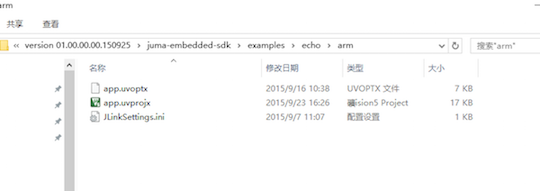
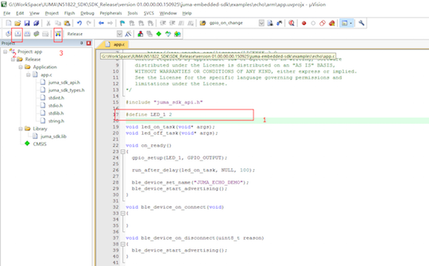
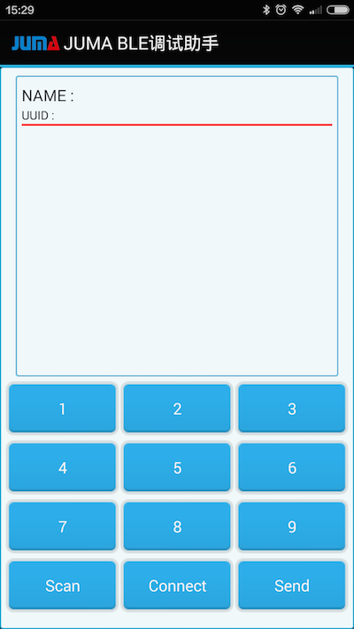
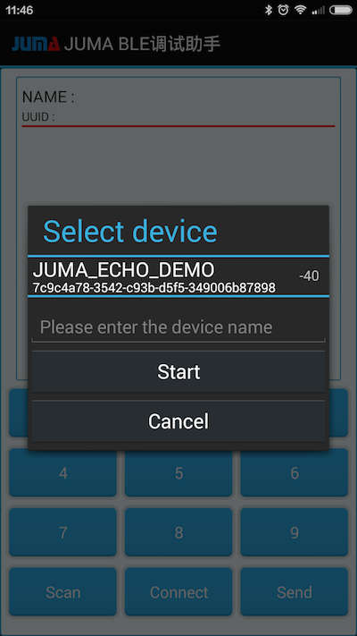

本例程用以说明如何在NOVA上实现ECHO例程，ECHO例程是需要将手机和NOVA进行通信。  
当NOVA接收到手机发来的数据后，会原封不动的回复给手机，以此体现ECHO(回声)的意思。

本例程的知识点：

* 嵌入式SDK的使用；
* NOVA的烧录；
* BLE通信(扫描、建立连接、收发数据)等；
* BLE调试助手的使用；


##获取SDK集成包
下载最新的嵌入式SDK(发布版)：  
[https://github.com/JUMA-IO/nRF51_Platform/releases](https://github.com/JUMA-IO/nRF51_Platform/releases)  
如JUMA nRF51 Platform SDK v1.0.2：   


```
注意，如果您想获知最新的代码改动情况，请使用github的“watch”功能。
```


##编译和下载固件
打开对应的echo的例子：  


双击 app.uvprojx打开对应的工程项目：之后打开app文件，会看到如下所示的内容。  



由于NOVA上面有一个LED其引脚为2所以，需要修改一下图中的那个宏定义，之后点击编译，最后执行下载。只要按照图中红框中的的步骤操作就可以了。

```
注：确保嵌入式环境搭建正确，请参阅右侧的“烧入方法”篇幅。
```

##安装BLE调试助手
1.应用市场安装

您可以从AppStore和应用宝，下载和安装“JUMA BLE调试助手”:

* iOS版本: [BLE调试助手_AppStore](https://itunes.apple.com/cn/app/juma-ble-diao-shi-zhu-shou/id1027737596?l=en&mt=8)
* Android版本: [BLE调试助手_应用宝](http://sj.qq.com/myapp/detail.htm?apkName=com.juma.helper)

2.Android APK安装

如果使用Android手机，在SDK集成包里含有“JUMA BLE调试助手”，可以直接安装：

  

3.自行编译源码安装

* iOS版本: [BLE调试助手_iOS_Github](https://github.com/JUMA-IO/BLE_Debugger_iOS)
* Android版本: [BLE调试助手_Android_Github](https://github.com/JUMA-IO/BLE_Debugger_Android)


##使用BLE调试助手连接NOVA
安装好安卓调试助手后，点击Scan进行设备扫描：

  

之后会看到如下的扫描结果：

  

- 点击 JUMA_ECHO_DEMO选取要连接的设备。  
- 点击下方的Connect进行连接。
- 发送相应的数据，在APP上可以看到会收到来自板子的与发送内容相同的回应。

