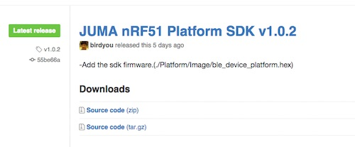
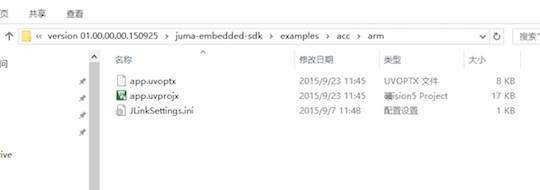
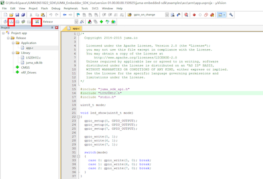
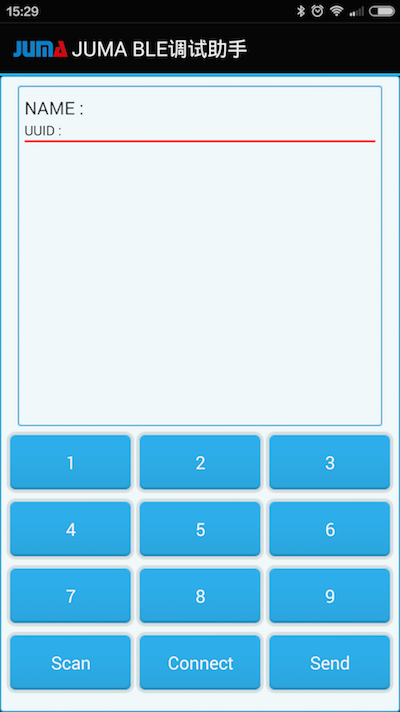
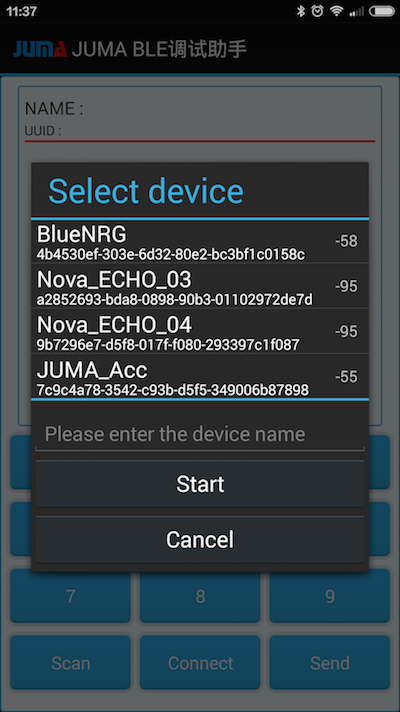
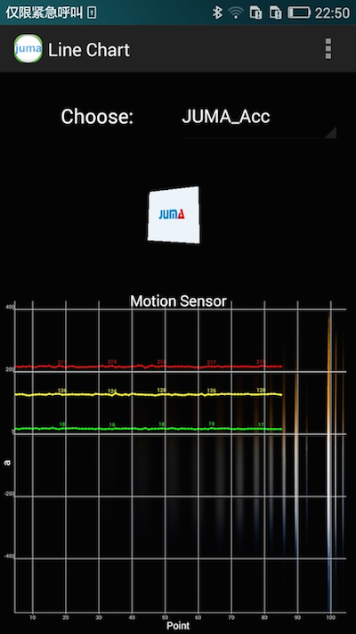
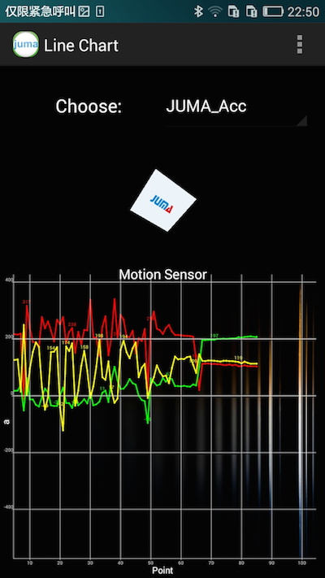

本例程用以说明如何在SMP上获取三轴加速度计的原始数据。
当SMP和手机建立连接后，会源源不断的发送三轴加速度计的数据给手机APP。

本例程的知识点：

* 嵌入式SDK的使用；
* SMP的烧录；
* BLE通信(扫描、建立连接、收发数据)等；
* BLE调试助手的使用；
* MotionSensor的使用；
* 三轴加速度计的原理；

***
##获取SDK集成包
下载最新的嵌入式SDK(发布版)：  
[https://github.com/JUMA-IO/nRF51_Platform/releases](https://github.com/JUMA-IO/nRF51_Platform/releases)  
如JUMA nRF51 Platform SDK v1.0.2：   


```
注意，如果您想获知最新的代码改动情况，请使用github的“watch”功能。
```

***
##编译和下载嵌入式固件
打开对应的acc的例子：  

  

双击 app.uvprojx打开对应的工程项目：之后按照顺序，先点击左侧红框内的东西，然后点击右侧红框内的的东西。（SMP板子必须已经处于连接好的状态）

  

```
注：确保嵌入式环境搭建正确，请参阅右侧的“烧入方法”篇幅。
```


##安装BLE调试助手
1.应用市场安装

您可以从AppStore和应用宝，下载和安装“JUMA BLE调试助手”:

* iOS版本: [BLE调试助手_AppStore](https://itunes.apple.com/cn/app/juma-ble-diao-shi-zhu-shou/id1027737596?l=en&mt=8)
* Android版本: [BLE调试助手_应用宝](http://sj.qq.com/myapp/detail.htm?apkName=com.juma.helper)

2.Android APK安装

如果使用Android手机，在SDK集成包里含有“JUMA BLE调试助手”，可以直接安装：

  

3.自行编译源码安装

* iOS版本: [BLE调试助手_iOS_Github](https://github.com/JUMA-IO/BLE_Debugger_iOS)
* Android版本: [BLE调试助手_Android_Github](https://github.com/JUMA-IO/BLE_Debugger_Android)


***
##使用BLE调试助手连接SMP
安装好安卓调试助手后，点击Scan进行设备扫描。  

   

之后会看到如下的扫描结果：

  

- 点击JUMA_Acc进行连接。
- 之后，点击下方的Connect进行连接。
- 然后就会源源不断的收到来自SMP板子的三轴的数据了。

***
##使用MotionSensor连接SMP
MotionSensor APP将SMP上三轴的数据显示为波形，它的下载地址见：  
[http://pan.baidu.com/s/1hqVQwMK](http://pan.baidu.com/s/1hqVQwMK)  

在工程的bin目录下找到MotionSensor.apk，将其安装到Android手机。

打开MotionSensor APP，扫描并连接相应的SMP开发板，会看到三轴数据的波形：

  

如果您移动或翻转SMP开发板，会发现三轴数据波形的变化：

  


