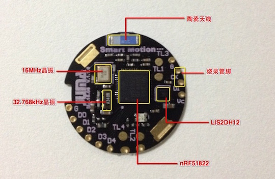

##简介
Smart Motion Platform(SMP)是针对可穿戴产品原型、运动算法研究等目的设计的强大开发平台。  

***
##硬件特性
- 低功耗蓝牙SoC芯片：Nordic nRF51822 QFAA；
- SoC集成ARM Cortex-M0内核；
- SoC集成256KB FLASH / 16KB RAM；
- SoC集成高精度(+-0.1℃) 温度传感器；
- 超低功耗三轴加速度计(运动传感器)：ST LIS2DH12；
- 峰值接受电流13mA；
- 峰值发射电流10.5mA(0dBm)；
- 发射功率范围: -20dBm~4dBm；
- 微安级别待机电流；
- 尺寸: 直径24mm x 厚度2.0mm；
- 续航: 220mAh的CR2032典型续航时间为1年；

***
##软件特性
- JUMA SDK；
- 用户代码区：32KB FLASH / 4KB RAM；
- 低功耗任务调度机制，支持32个任务调度；
- 开放BLE API接口（嵌入式端/APP端）；
- 三轴传感器数据接口（嵌入式端/APP端）；
- 嵌入式软件空中升级（嵌入式端/APP端）；
- 计步算法参考例程；
- To Be Continued...；

***
##规格手册
请下载：[SMP.pdf](http://www.juma.io/spec/smp.pdf)

***
##更多资料
请访问：
[http://www.juma.io/platform/smp.html](http://www.juma.io/platform/smp.html)

