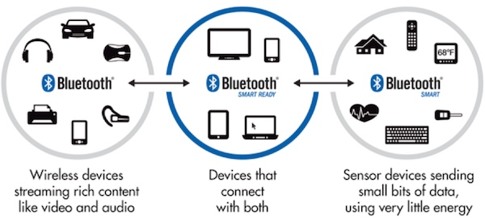
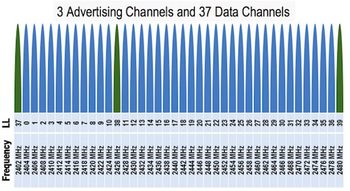
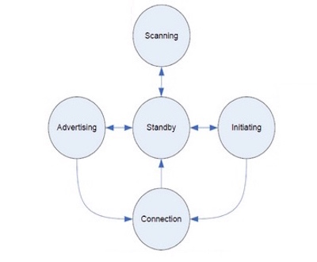
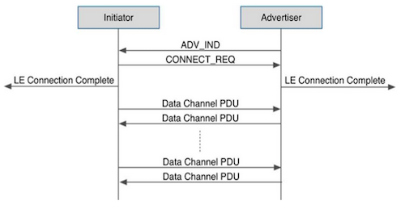
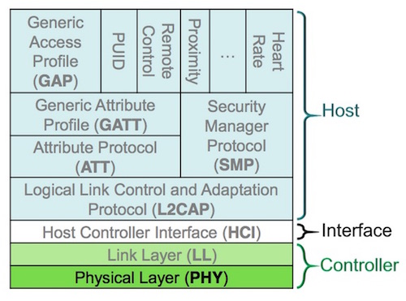
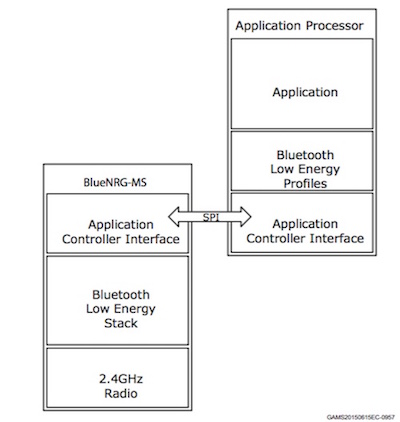

现在一样东西能称得上智能硬件，它得有一个前提条件：能和手机通信。我们看一下物联网的几大热门无线通信技术：

* 蓝牙：低成本、低功耗，设备和手机可以直接通信；
* WiFi：使用广泛、功耗略高，需要借助路由器上网，手机和设备通过英特网/局域网来通信；
* Zigbee：成本略高，需要借助网关上网，手机和设备通过英特网来通信；
* 3G/4G：成本高，需要3G/4G手机卡，设备和手机通过英特网来通信；

得益于手机的直接支持，一个蓝牙设备可以无需借助外力就和手机通信，这让蓝牙在无线个人局域网(WPAN)中广泛使用。近些年来，可穿戴、智能家居、车载设备等领域也随处可见蓝牙技术的影子。

现在，小钢炮出场了，它的特色是*“蓝牙+传感器”*。目的就是要把传感器的数据，通过低成本、低功耗的蓝牙技术，传给手机，甚至英特网。

通过本文，希望让大家在玩小钢炮之前，对蓝牙有一个感性的认识。

> “当蓝牙遇上传感器” —— 小钢炮来了。

***
## 低功耗蓝牙

蓝牙技术联盟(Bluetooth SIG)在2012年推出了蓝牙4.0技术规范，它包含了三个方面：


* 传统蓝牙(Bluetooth)：适用于传输音频、音乐、文件等数据的场合，如蓝牙耳机、鼠标键盘等。
* 低功耗蓝牙(Bluetooth Smart)：适用于小数据量传输，但对功耗又敏感的场合，如智能手环、iBeacon等。低功耗蓝牙又称之为Bluetooth Low Energy(BLE)。
* 双模蓝牙(Bluetooth Smart Ready)：双模蓝牙是兼容传统蓝牙和低功耗蓝牙两种技术指标的规范，如手机和电脑就属于双模蓝牙设备。

低功耗蓝牙的主要特点包括：

* 超低峰、平均和空闲模式功耗；
* 一颗纽扣电池可以长时间工作；
* 较低的物料及生产成本；
* 协议简单，适用于小数据量传输；
* 多平台支持，如iOS 7.0+和Android 4.3+移动平台，以及大多数PC平台；

***
## 必备知识
###1. 物理信道
低功耗蓝牙运行在2.4GHz ISM频段，GFSK调制方式，Bit-rate：1Mbit/s。

它有40个频道，频道间隙为2MHz，其中3个为固定的广播通道，其余37个为跳频的数据通道。

  

###2. 状态和角色

低功耗蓝牙有几种状态：



-  待机状态(Standby)：默认状态，不做任何事情
-  广播状态(Advertising)：广播状态（周期性）
-  扫描状态(Scanning)：搜索正在广播的设备
-  发起连接状态(Initiating)：向某个已被搜索到的设备主动发起连接
-  连接状态(Connection)：两个设备之间建立起数据通道

低功耗蓝牙有两种角色：

-  主设备(Master)：主动发起连接的一方
-  从设备(Slave) ：被动接受连接的一方，通常是周期性发送广播

###3. 典型通信过程

一次典型的低功耗蓝牙通信过程为：



1. 从设备发射广播
2. 主设备开启扫描
3. 主设备搜索到从设备的广播
4. 主设备发起连接请求
5. 从设备响应连接请求
6. 主设备和从设备建立起连接
7. 主设备和从设备之间传输数据
8. 断开连接

> 只有处于两个相互建立*连接*的设备，才能发送数据。


###4. 协议
低功耗蓝牙协议是分层的：



重要协议如下：

-  PHY：物理层，包含信道、频段、调制方式等概念；
-  LL：链路层，包含比特率、时序、纠错等概念；
-  L2CAP：逻辑链路控制适配层，包含如建立链连接、断开连接等概念；
-  ATT：属性层，包含如设备UUID等概念；
-  GATT：通用属性层，包含特征值、描述符等概念；
-  GAP：各种Profile的基础；
-  Profile：针对某些特定应用商定的协议，如心率、近距离感应、遥控等；

整个协议可以分成Controller和Host两部分，有两种实现方式：

-  单芯片方案（SoC方案）：Controller、Host、Profile、Application在同一芯片中，市面常见的TI CC254x、Nordic nRF51822等都是单芯片方案；
-  双芯片方案：Controller属于一个芯片(蓝牙收发控制器)，Host、Profile、Application属于另一个芯片（通常为一个MCU）。本文描述的BlueNRG就是一个单纯的Controller，外需配有一个MCU；
-  HCI：Host和Controller之间的接口，一般为SPI、Uart、USB等总线；

> 单芯片方案 vs 双芯片方案：并没有好与坏，只有合适不合适，选择哪种取决于应用场景。双芯片方案架构灵活，可以适配多种MCU；单芯片方案简单小巧，易于实现。

***
## BlueNRG芯片
BlueNRG是意法半导体(ST)推出的一款蓝牙控制器芯片(Controller)。它功耗极低、发射功率可以达到+8dB，是业内发射距离最远的低功耗蓝牙芯片。

BlueNRG属于上面描述的*双芯片方案*，它内部实现了蓝牙协议栈。实际应用中，外面需配有MCU，MCU负责完成Profile和应用层事物，而BlueNRG负责完成蓝牙通信的任务：



小钢炮使用了BlueNRG-MS+STM32F401的双芯片方案，其中：

- BlueNRG-MS是支持M/S(Master/Slave，主从一体)协议栈的芯片版本；
- STM32F401是性能强大的MCU，可以完成各类算法、协议等，片内资源是单芯片方案难以比拟的；
- HCI使用了SPI总线作为BlueNRG-MS和STM32F401之间的接口；

更多关于BlueNRG的资源介绍请参阅[这里](http://pan.baidu.com/s/1o76rwbo#path=%252F%25E5%25B0%258F%25E9%2592%25A2%25E7%2582%25AE_%25E8%258A%25AF%25E7%2589%2587%25E8%25B5%2584%25E6%2596%2599%252F%25E6%259D%25BF%25E8%25BD%25BD%25E5%2599%25A8%25E4%25BB%25B6%25E8%25B5%2584%25E6%25BA%2590%25E8%25B5%2584%25E6%2596%2599%252F%25E8%2593%259D%25E7%2589%2599)。


***
## 嵌入式API
为了方便操控BlueNRG，我们提供了低功耗蓝牙SDK，它封装了在MCU上的蓝牙操作。

通过头文件，我们可以看到相应的API，在线阅读点击[这里](https://github.com/JUMA-IO/STM32_Platform/blob/master/system/middlewares/juma/sdk/bluenrg_sdk_api.h)。

本地文件位于SDK的`/system/middlewares/juma/sdk/bluenrg_sdk_api.h`路径下。

摘取部分API如下：

```
/* 设置设备广播名称 */
tBleStatus ble_device_set_name(const char* new_device_name);

/* 设置设备广播间隔 */
void ble_device_set_advertising_interval(uint16_t interval);

/* 设置设备地址 */
tBleStatus ble_address(uint8_t* advaddress);

/* 开始广播 */
tBleStatus ble_device_start_advertising(void);

/* 停止广播 */
tBleStatus ble_device_stop_advertising(void);

/* 发送数据 */
tBleStatus ble_device_send(uint8_t type, uint32_t length, uint8_t* value);

/* 断开连接 */
tBleStatus ble_disconnect_device(void);

/* 收到数据的回调事件 */
void ble_device_on_message(uint8_t type, uint16_t length, uint8_t* value);

/* 建立连接的回调事件 */
void ble_device_on_connect( void );

/* 断开连接的回调事件 */
void ble_device_on_disconnect(uint8_t reason);

```

> 关于每个API的详细说明请点击[这里](http://www.juma.io/doc/zh/embedded_api/ble/)。

有了对蓝牙的感性认知，接下去，我们继续深入学习代码。