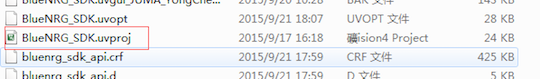
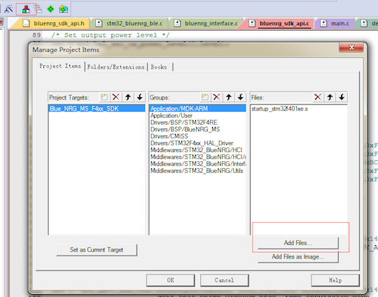
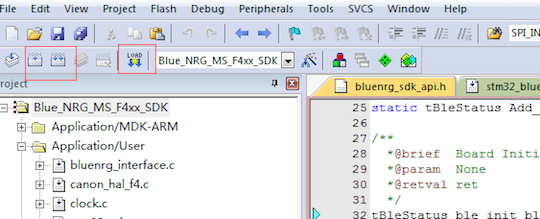

##烧录步骤
###1. 打开Keil工程文件
用git上提供的种子工程或者自己新建的keil工程：  

下载路径为：  
[https://github.com/JUMA-IO/STM32_Platform/releases](https://github.com/JUMA-IO/STM32_Platform/releases)  
> 打开product目录下的任意工程即可。

###2. 进行工程配置
Step1. 选择MCU型号：  
  

Step2. 进行宏定义，注意头文件路径包含的信息：  
  

Step3. 调试器选择：JLink或者STLink  
  
  

这里以JLink为例，将Gnd、Data、Clk、Vcc四根引脚分别到Cannon上对应的接口：
  

Step4. 按如下图配置，出现图右侧的设备信息则表示设备正常连接，否则检查JLink或者STLink连线：  
  

Step5. 选择MCU Flash大小：  
  

Step6.如果不适用种子工程，则需要添加相应的c文件：  
    

###3. 编译运行或者直接下载
  

