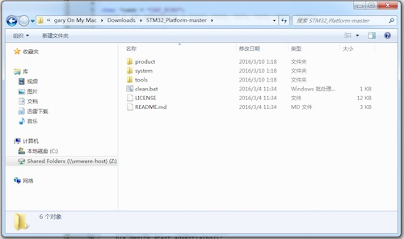
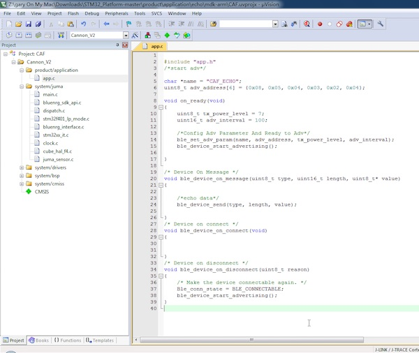
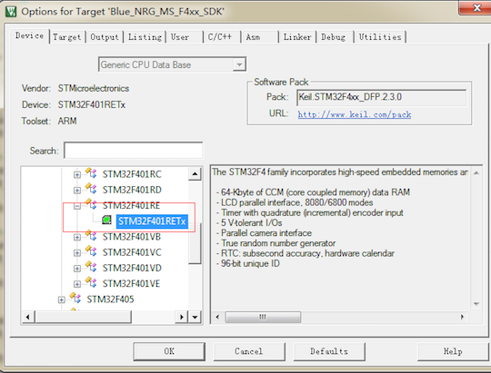
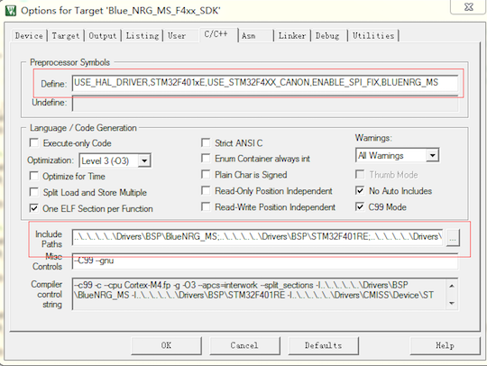
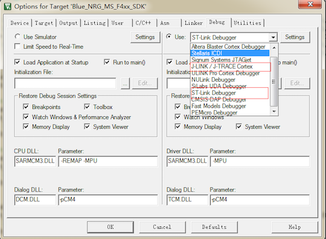
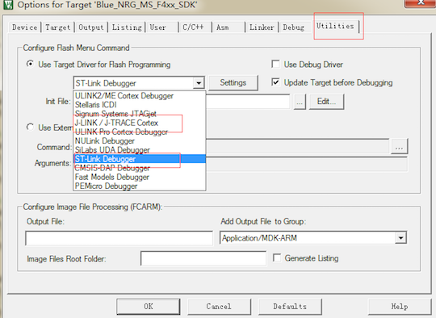
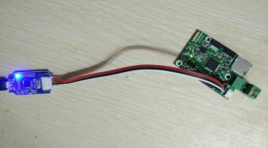
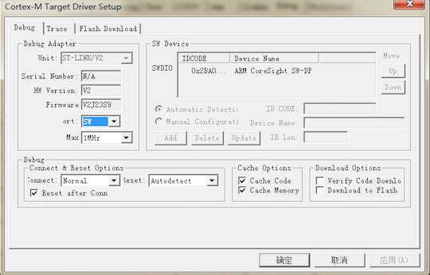
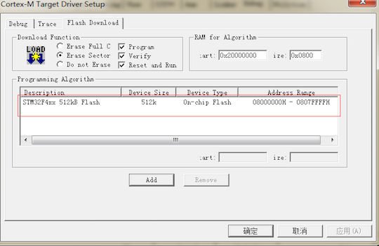
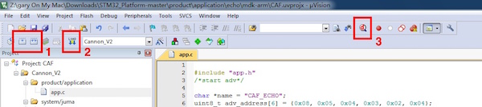

##打开一个工程

在`Cannon的第一次`篇幅中，我们已经下载了github上的软件包。如果您还没有下载，在此附上下载链接：

```
github上托管的软件仓库地址：  
https://github.com/JUMA-IO/STM32_Platform

以下地址是经过发布的软件包：
https://github.com/JUMA-IO/STM32_Platform/releases
```

下载后，目录结构如下图所示：



`product\application`下是提供的Cannon开发例程，我们打开其中的一个工程，双击运行`.uvoptx`即可，譬如：

```
x:\STM32_Platform-master\product\application\echo\mdk-arm\CAF.uvoptx
```

打开后，Keil的工程界面如下图所示：




##进行工程配置
默认情况下，工程配置不需要修改。不过，在此我们学习一下如何正确的修改工程配置。

####1. 选择MCU型号 
  

####2. 进行宏定义
注意头文件路径包含的信息
 
  

####3. 调试器选择：J-Link或者STLink  
  
  

这里以J-Link为例，将Gnd、SWDIO、SWCLK、VCC分别到Cannon上对应的接口：

  

> 如果对硬件连接不清楚，请参阅左侧的`Cannon的开发环境`篇幅。

####4. 检查J-Link和STLink的连接
按如下图配置，出现图右侧的设备信息，表示设备正常连接，否则需检查J-Link或者STLink连线：  

  

####5. 选择MCU Flash大小  
  


##编译、下载或调试
经过上述步骤，如果J-Link或者STLink配置正确，我们便可以对工程进行编译、下载和调试。

 

```
上图的三个序号分别表示：
1 - 编译或者全部编译；
2 - 下载代码至Cannon；
3 - 在线调试代码；
```

观察日志输出，如果按部就班的操作本系列说明，应该不会出现错误信息。  

至此，我们完成了Cannon工程的开发环境搭建工作，之后，我们将介绍Cannon的应用例程。

