我们使用Keil V5作为Cannon的开发环境，如果您喜欢其他的ARM开发环境，如IAR等，当然也可以作为开发环境，不过本系列都是基于Keil的来说明的。  

> 本文介绍Keil的下载、安装、获取MCU Pack以及连接调试器。


##获取软件资源

###1. 官方下载
您可以从Keil的官网获取Keil的安装包，请访问：[http://www.Keil.com/](http://www.Keil.com/)

###2. 网盘下载
我们也将Keil V5.14版本的安装包上传至网盘，方便您的下载，请访问：[http://pan.baidu.com/s/1jGTe0VO](http://pan.baidu.com/s/1jGTe0VO)

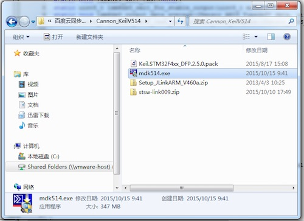

下载后得到上述文件，分别为：

```
mdk514.exe                    - Keil V5.14的安装包
Keil.STM32F4xx_DFP.2.5.0.pack - STM32F4系列的MCU包(MCU PACK)
Setup_JLinkARM_V460a.zip      - J-Link驱动程序
stsw-link009.zip              - STLINK驱动程序
```


> 1. 默认情况下，Keil为试用版本，编译的时候有代码大小的限制。  
> 2. MCU包(MCU Pack)就是关于各种芯片的配置和标准库文件等。


***
##安装Keil
1) 双击MDKxxx.exe开始安装，出现如下图所示的界面：

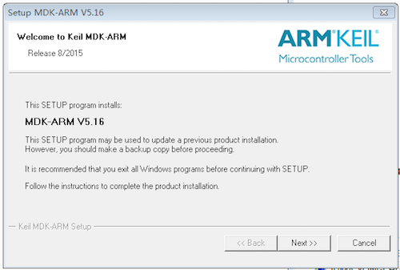

2) 点击“Next”，进入下一步：  

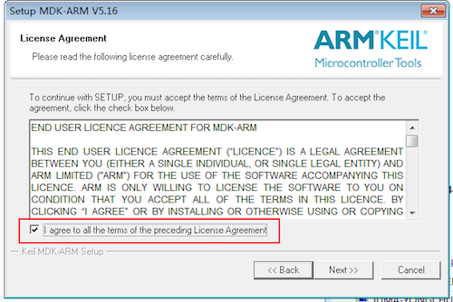

3) 选中红色框中表示接受Keil的协议，然后点击“Next”进入下一步的安装：  

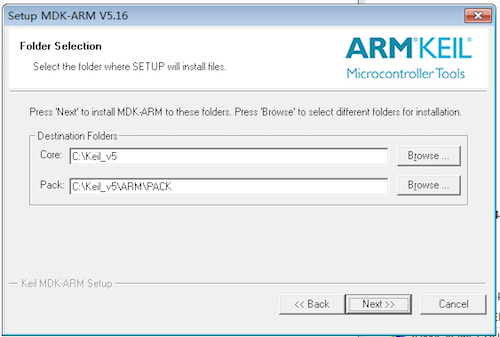

4) 这一步中选择安装位置以及包的位置。包就是各种芯片的配置和标准库文件等，这个位置要记住，等会的时候可能会用到。选择好后，点击“Next”：  

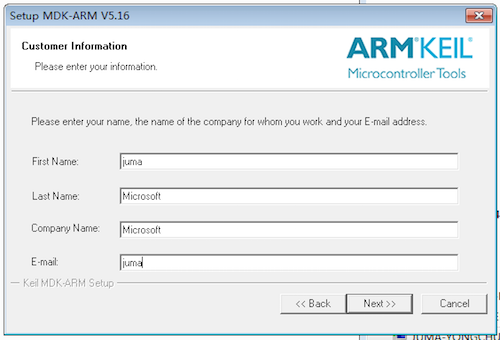

5) 这里需要的是填写相关的个人信息，不过经发现，这里可以随意的填写就可以了，感谢Keil如此（人性化的）设计。当随意或者根据自己的情况填写好信息后点击“Next”： 
 
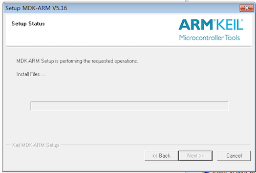

6) 在这个界面中需要稍作停留，等待一段时间后，会进行一次询问：是否需要安装Keil的一个下载工具：  

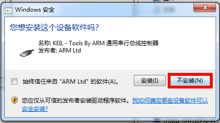

7) 出现上图的选择后，可以选择不安装。虽然现在磁盘大，但没必要去浪费那点磁盘空间。之后经过一点点时间等等待后就会提示安装成功了。  

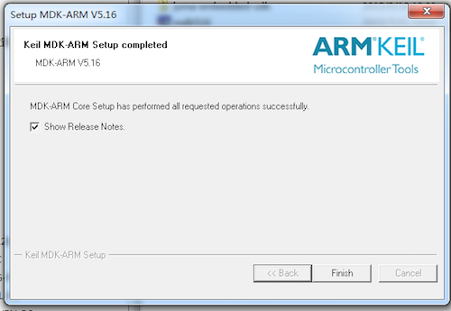


***
##安装MCU包
从Keil5.10之后的版本开始内部集成了包管理机制，以此可以方便的对各种MCU的库文件等进行管理。

###1. MCU包管理机制
第一次运行Keil之后会自动提示更新packs操作，如下图所示：  

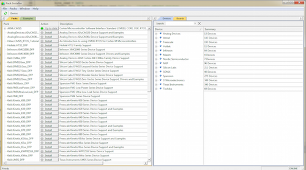

若非第一次运行Keil，也可以通过点击下图红圈中的按钮，来打开上述pack的界面：

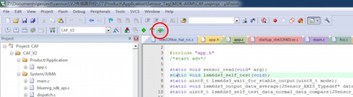

###2. 安装STM32F4xx MCU包
因为是在线下载所以很可能受限于网络，如果更新失败，会出现如下的状况： 
 
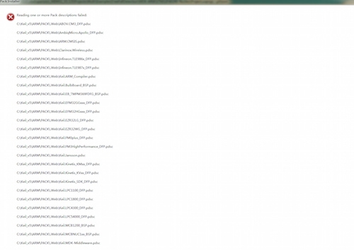

因此，我们建议直接导入对应MCU pack。您可以从Keil官网下载对应MCU的pack，下载地址为：[http://www.Keil.com/dd2/pack/](http://www.Keil.com/dd2/pack/)
 
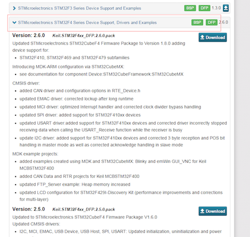

我们网盘的打包下载中也有STM32F4xx的包，即`Keil.STM32F4xx_DFP.2.5.0.pack`。

获取对应的pack，然后后双击.pack文件即可导入Keil。 


##安装STLink或J-Link
Cannon支持STLink和J-Link两大烧写器或调试器，如果您手上没有，可以自行在“某宝”上购买。

###1. 获取STLink或J-Link硬件
STLink和J-Link(OB)分别如下图所示：

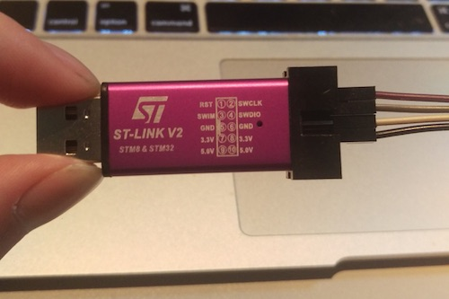

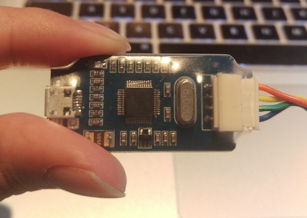

> 1. 下图实际为J-Link OB(OnBoard)。  
> 2. 现在先不用将STLink/J-Link与Cannon相连接。

###2. 安装驱动

1) 下载到J-LINK与STLink的安装包；  

> 我们网盘的打包下载中也有它们的驱动，分别为`Setup_JLinkARM_V460a.zip`和`stsw-link009.zip`。

2) 双击安装包文件一路点击“Next”直至安装成功；   
3) 将STLink或J-Link插到电脑上；  
4) 如果在设备管理中能看到相应的设备驱动，说明安装驱动成功；    
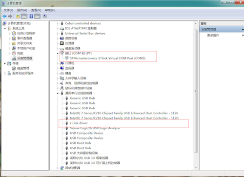

##连接Cannon

该部分介绍如何将STLink或J-Link连接上Cannon。

###1. SWD调试口
Cannon板载的SWD调试口位于下图红色矩形框的位置：

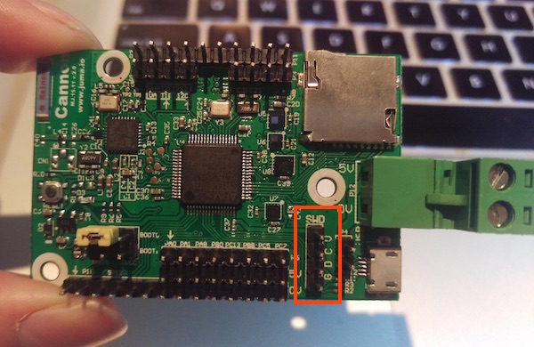

```
图中，G、D、C、V分别对应：
G - GND，接地；
D - SWDIO，数据；
C - SWCLK，时钟；
V - VCC，电源；
```

###2. STLink连接Cannon

STLink上标注了SWCLK、SWDIO、GND、3.3V，用杜邦线分别连接Cannon上的C、D、G、V。之后连接电脑，如下图所示：

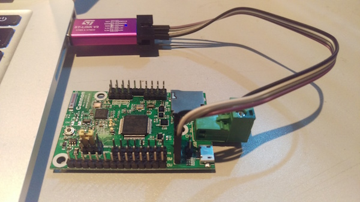

###3. J-Link连接Cannon
同理，如果您使用J-Link，上面标注了SWCLK、SWDIO、GND、3.3V，用杜邦线分别连接Cannon上的C、D、G、V。之后连接电脑，如下图所示：

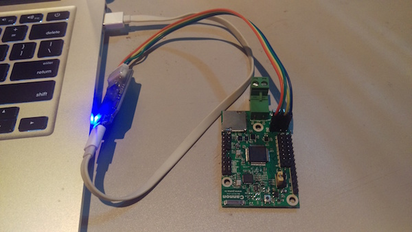

> 至此，硬件上的连接已经完成。下一篇中，我们将介绍项目工程配置，以实现代码的烧入或下载。