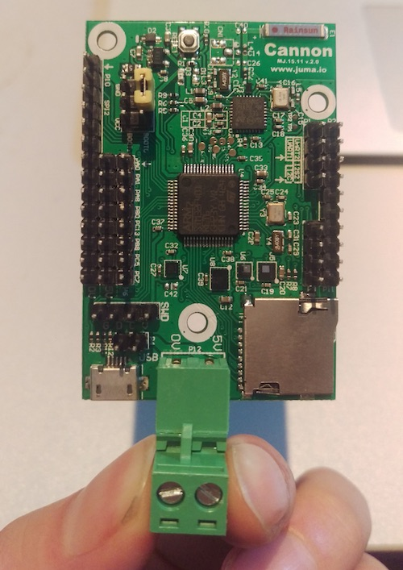
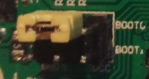
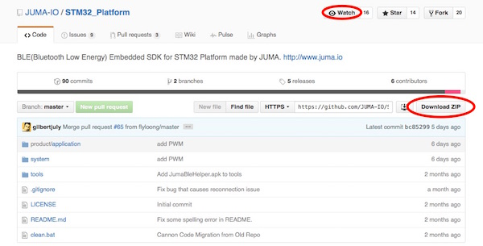
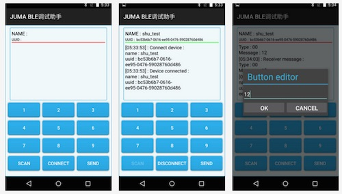
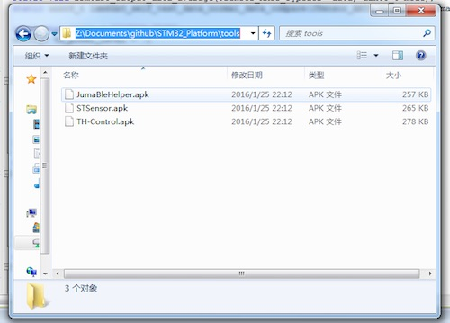

本文介绍首次使用Cannon(即小钢炮，以下简称“Cannon”)开发平台的一些准备工作，包括：

* 重要的跳线和引脚
* 烧写器或调试器
* 开发环境
* Cannon代码和例程
* APP调试工具

> 强烈建议看完本片介绍后，再进行后续操作，请您有点耐心哦。^_^


***
##开箱操作
###1. 外观
拿到Cannon后，首先确保硬件外观良好，没有例如假焊、虚焊、漏焊或者PCB损害等现状。一个正常的Cannon看上去是下面这个样子的：  



###2. 跳线
STM32F401支持多种启动模式，一般情况下，应将Boot0接地，如下图所示：  



> 1. 本系列后续的介绍都是基于Boot0接地的前提条件。  
> 2. 关于STM32F401的不同启动模式，请查阅STM32F401的开发文档或芯片手册。


***
##烧写器或调试器
Cannon支持STLink和J-Link两大烧写器或调试器，如果您手上没有，可以自行在“某宝”上购买。

###1. STLink


###2. J-Link


> 关于STLink和J-Link的使用和配置，请参阅左侧`Cannon的开发环境`一篇。
> 不过先别急，建议您先看完本篇，做好所有的准备工作，我们一步步来。  

***
##准备开发环境
我们使用Keil V5作为Cannon的开发环境，如果您喜欢其他的ARM开发环境，如IAR等，当然也可以作为开发环境，不过本系列的介绍都是基于Keil的。

您可以从Keil的官网获取Keil的安装包，请访问：[http://www.keil.com/](http://www.keil.com/)

我们也将Keil V5.14版本的安装包上传至网盘，方便您的下载，请访问：[http://pan.baidu.com/s/1jGTe0VO](http://pan.baidu.com/s/1jGTe0VO)

> 1. 关于Keil的使用和配置，请参阅左侧`Cannon的开发环境`一篇。   
> 2. 默认情况下，Keil为试用版本，编译的时候有代码大小的限制。

***
##Cannon代码和例程

Cannon的SDK封装了蓝牙通信、中间件、底层驱动、任务调度等内容，为开发者提供便捷的应用层开发框架。SDK和应用层的例程现在已经完全开源，您可以访问github来获取相关代码。  

Github上Cannon的代码空间：[https://github.com/JUMA-IO/STM32_Platform](https://github.com/JUMA-IO/STM32_Platform)




###1. 代码下载
您可以点击右侧的`Download ZIP`打包下载整份代码，其中包括了几个部分：  

* product/application: Cannon的应用层例程；
* system: Cannon的底层驱动、中间件、算法、任务调度、编程框架等；
* tools: 移动端的调试工具；


###2. 保持更新

Cannon是一个开源项目，我们包括全国的开发者都可以提交代码改动，如果您想及时收到更新通知，请点击上方的`Watch`。

如果您觉得Cannon项目有点意思，符合您的品味，您也可以为我们点一个赞，就是点击旁边的`Star`按钮，小编在此先谢过啦。

###3. 提交代码
日后，如果您在使用Cannon的过程中发现Bug，或者想给Cannon增加一些新的功能，也欢迎您给我们提交代码。您可以点击左侧的`90 commits`，查看Cannon代码提交的历史记录。

> 1. 如果您只是想试用一下Cannon，那打包下载好代码即可，不需了解“保持更新”、“提交代码”等事宜。  
> 2. github基于git的工作原理，如果您想学习git，这里有一篇很好的[入门文章](http://www.ruanyifeng.com/blog/2015/08/git-use-process.html)。

***
##手机端的调试工具

为了方便调试嵌入式代码，我们提供了手机端的BLE调试助手，可以实现手机和设备之间原始数据的收发。现在您可以从Appstore、应用宝等应用市场直接下载，或者自行编译源码。



###1. 应用市场下载安装

* iOS版本: [BLE调试助手_AppStore](https://itunes.apple.com/cn/app/juma-ble-diao-shi-zhu-shou/id1027737596?l=en&mt=8)
* Android版本: [BLE调试助手_应用宝](http://sj.qq.com/myapp/detail.htm?apkName=com.juma.helper)

> 在您的手机上，打开Appstore、应用宝等应用市场，搜索“BLE调试助手”便可找到。

###2. 源码编译安装
* iOS版本: [BLE调试助手_iOS_Github](https://github.com/JUMA-IO/BLE_Debugger_iOS)
* Android版本: [BLE调试助手_Android_Github](https://github.com/JUMA-IO/BLE_Debugger_Android)

###3. Android手机直接安装APK文件

如果您使用Android手机，可以直接安装BLE调试助手的APK文件。打包下载好github上的文件后，APK文件位于：

```
X:\STM32_Platform\tools\JumaBleHelper.apk
```



> 如果您不知道如果将APK安装至手机，请参阅[这篇文章](http://jingyan.baidu.com/article/eae07827eda2fa1fec548527.html)哦。
