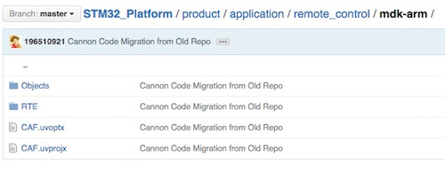
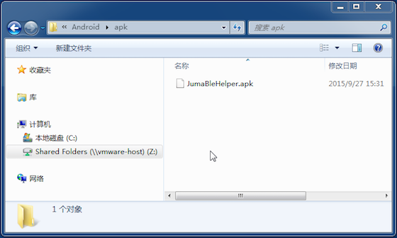
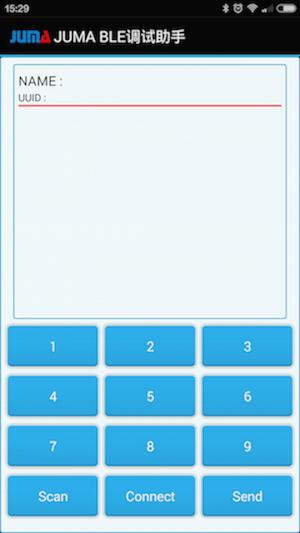
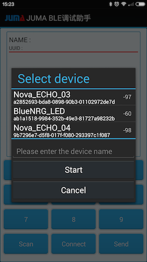

##概述
本例展示手机APP如何通过蓝牙遥控点亮Cannon开发板上的LED。通过本例您可以学习SDK中BLE APIs和调度APIs的用法。

***
##获取嵌入式SDK及例程
下载最新的嵌入式SDK(发布版)：  
[https://github.com/JUMA-IO/STM32_Platform/releases](https://github.com/JUMA-IO/STM32_Platform/releases)  
如JUMA STM32 Platform SDK v1.0.0：   


> 如果您想获知最新的代码改动情况，请使用github的“watch”功能。


***
##编译和烧录嵌入式软件
####Step1. 打开样本工程：
```
x:/Cannon/product/application/remote_control/mdk-arm/CAF.uvproj
```


####Step2. 编译工程


####Step3. 烧入软件


***
##安装“BLE调试助手”APP
不像先前的SensorTag，我们没有为遥控点灯专门制作一个APP，不过您可以通过“BLE调试助手”来实现遥控点灯。就像它的命名一样，“BLE调试助手”是一个调试APP，可以发送或接收手机和设备之间的原始蓝牙数据。本例中，我们使用“BLE调试助手”给Cannon发送一个数据，Cannon接收到该数据后，就点亮LED。  

####1.应用市场安装

您可以从AppStore和应用宝，下载和安装“JUMA BLE调试助手”:

* iOS版本: [BLE调试助手_AppStore](https://itunes.apple.com/cn/app/juma-ble-diao-shi-zhu-shou/id1027737596?l=en&mt=8)
* Android版本: [BLE调试助手_应用宝](http://sj.qq.com/myapp/detail.htm?apkName=com.juma.helper)

####2.Android APK安装

如果使用Android手机，在SDK集成包里含有“JUMA BLE调试助手”，可以直接安装：

  

####3.自行编译源码安装

* iOS版本: [BLE调试助手_iOS_Github](https://github.com/JUMA-IO/BLE_Debugger_iOS)
* Android版本: [BLE调试助手_Android_Github](https://github.com/JUMA-IO/BLE_Debugger_Android)


***
##和手机APP通信
####Step1. 打开手机的蓝牙功能


####Step2. 运行“BLE调试助手”APP  
打开后的界面如下：  


####Step3. 扫描和连接设备
点击Scan进行设备扫描，之后会看到如下的扫描结果：   


选择“BlueNRG_LED”或者“Cannon”起始的设备名，再点击Start/Connect按钮进行连接。  

####Step4. APP发送数据遥控点灯
之后APP可以发送数据给Cannon，Cannon接受到特定的数据后，会点亮LED。具体做法为：  

- 长按按钮“1”，在编辑框中输入“01”(十六进制的数值)表示点灯。
- 长按按钮“2”，在编辑框中输入“00”(十六进制的数值)表示熄灭。

然后点击按钮1或者按钮2，APP就会给Cannon发0x01和0x02了。

```
注意，调试助手会封装数据，比如：
点亮LED时数据内容为：0x01，实际发送0x010101；
熄灭时数据位内容为：0x00，实际发送0x010100。
其中数据格式为：第1个字节为数据类型，第2个字节为数据长度，第三个字节为数据内容。    
```

***
##阅读代码
本例中的嵌入式代码位于：  

```
x:/Cannon/product/application/remote_control/app.c
```

代码量很少，已配有注释，非常方便阅读。  
如果您对其中的BLE APIs和调度APIs有所疑问，请查阅相应的API说明：  
[http://www.juma.io/doc/zh/embedded_api/guide/](http://www.juma.io/doc/zh/embedded_api/guide/)