为了方便调试代码，本文用以说明如何通过小钢炮输出日志。


***
## 串口日志
### 1. 软件配置
打开工程配置窗口，将条件编译栏的空定义`NO_PRINTF`去掉。

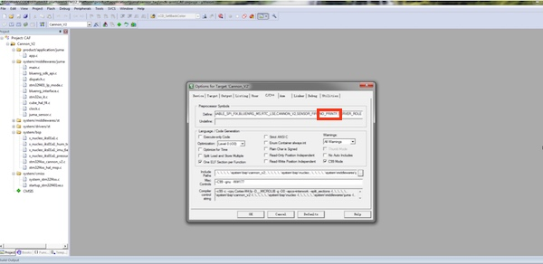

### 2. 硬件配置

小钢炮上串口的硬件接口如下，分别对应串口的3V3、RX、TX、GND四个引脚：

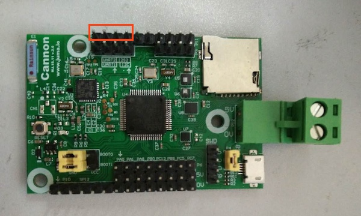

您也可以通过原理图，查看详细信息(`x:/documents/cannon_v2/Cannon_V2_SCH.pdf`)：


### 3. 示例

在代码中加入`printf`：

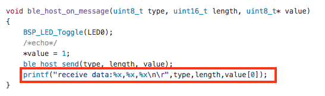

通过电脑上的串口调试查看日志，波特率设置为115200bps、无校验位：

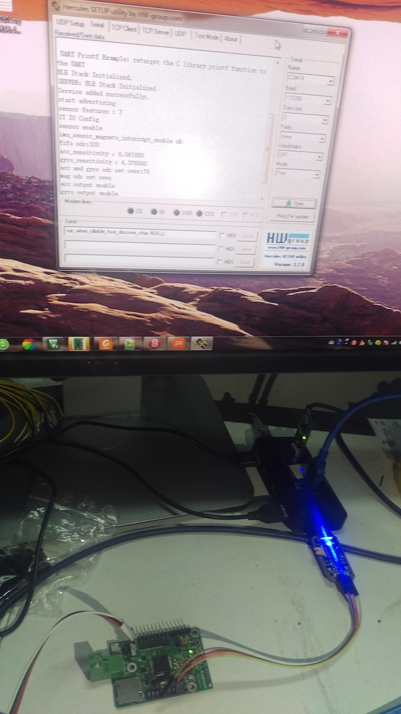


***
## BLE调试助手日志
***
###1. 下载&安装BLE调试助手APP

为了方便调试嵌入式代码，我们提供了手机端的BLE(低功耗蓝牙)调试助手，可以实现手机和设备之间原始数据的收发。现在您可以从Appstore、应用宝等应用市场直接下载，或者自行编译源码。

####(1) 应用市场下载安装

* iOS版本: [BLE调试助手_AppStore](https://itunes.apple.com/cn/app/juma-ble-diao-shi-zhu-shou/id1027737596?l=en&mt=8)
* Android版本: [BLE调试助手_应用宝](http://sj.qq.com/myapp/detail.htm?apkName=com.juma.helper)

> 在您的手机上，打开Appstore、应用宝等应用市场，搜索“BLE调试助手”便可找到。

####(2) 源码编译安装
* iOS版本: [BLE调试助手_iOS_Github](https://github.com/JUMA-IO/BLE_Debugger_iOS)
* Android版本: [BLE调试助手_Android_Github](https://github.com/JUMA-IO/BLE_Debugger_Android)

####(4) Android手机直接安装APK文件

如果您使用Android手机，可以直接安装BLE调试助手的APK文件。打包下载好github上的文件后，APK文件位于：

```
X:\STM32_Platform\tools\JumaBleHelper.apk
```


> 如果您不知道如果将APK安装至手机，请参阅[这篇文章](http://jingyan.baidu.com/article/eae07827eda2fa1fec548527.html)哦。


###2. 使用说明

以Android版的BLE调试助手为例，说明操作步骤，iOS版本的操作雷同。

####(1) 搜索设备

点击“SCAN”用于搜索周围的BLE设备。

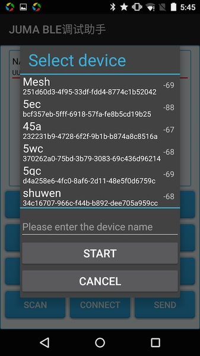

需要注意的是，BLE调试助手的通过service UUID过滤出使用JUMA SDK的设备：

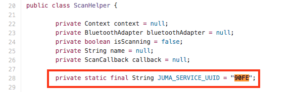

```
这部分的代码参见：
Android BLE SDK：https://github.com/JUMA-IO/BLE_SDK_Android
iOS BLE SDK：https://github.com/JUMA-IO/BLE_SDK_iOS
```


####(2) 选择设备

点击“SCAN”对话框中的某个设备，之后的操作都针对该设备。

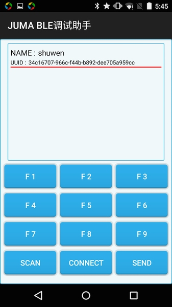

####(3) 建立BLE连接

点击“CONNECT”，和该设备建立起BLE连接，APP会显示日志信息：

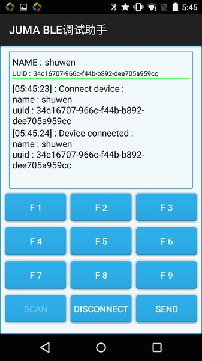

####(4) 编辑发送数据

点击“SEND”，用于编辑发送的数据，Type为“0x09”。

F1、F2~F9为快捷按钮，*长按*可以用于编辑发送数据，Type为“0x00”、“0x01”~“0x08”。

> 1. 所有编辑的数据均为十六进制数值，您不用在前面加“0x”前缀。  
> 2. 收发数据的编码符合TLV格式，即Tyep、Length、Value，定义参见[这里](http://www.juma.io/doc/zh/embedded_api/ble/#_12)。 

APP端的代码实现参见[这里](https://github.com/JUMA-IO/BLE_Debugger_Android/blob/master/src/com/juma/helper/MainActivity.java)，发送部分的关键代码为：

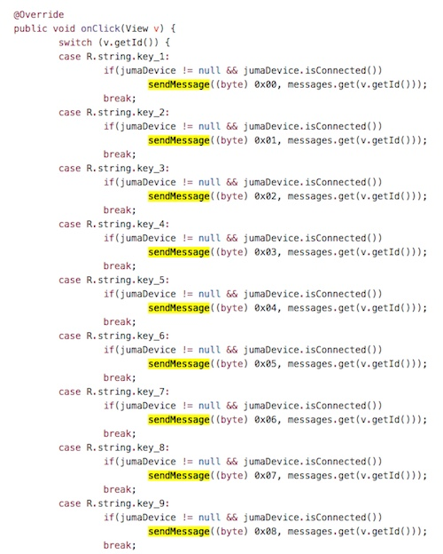


####(5) 查看收发数据

您编辑的发送数据，和从设备收到的数据，都会显示在APP上方的日志区域：

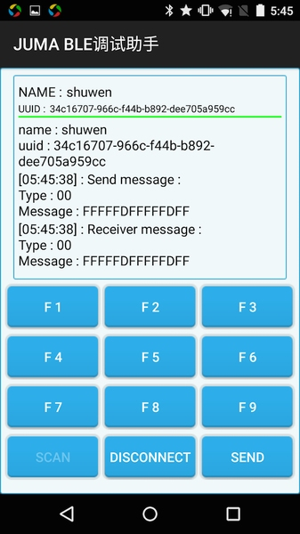

####(6) 断开BLE连接

最终，点击“DISCONNECT”以断开和设备之间的连接：

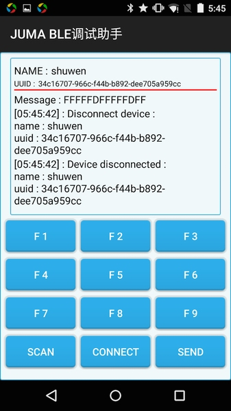


